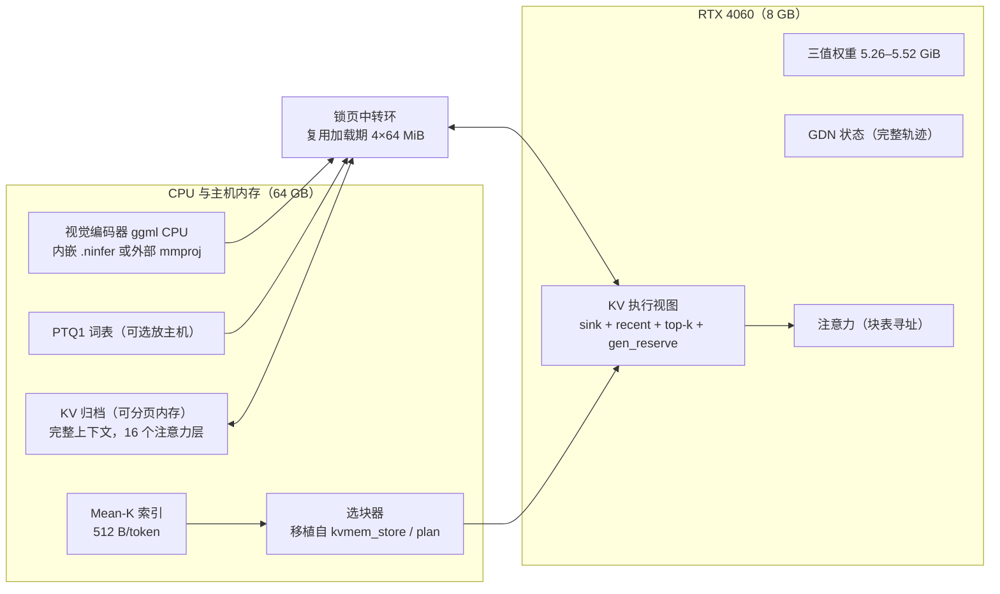
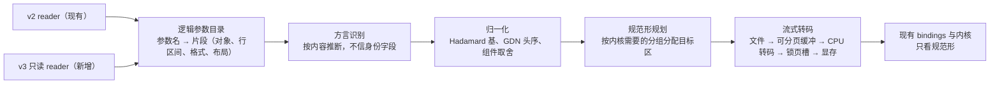

# RTX 4060 Laptop 上运行 Ternary Bonsai 2 27B：视觉 CPU 卸载 + KVMem 分层 KV

可行性分析与设计文档 · v1.2 · 2026-09-30

- v1.1：增补 5.8「RTX 40 系通用版」与 5.9「兼容全部 Bonsai NInfer 方言」。
- v1.2：你的分支完成了视觉双源（`221290ba`），5.5 改为记录实际实现；同步修订 0、2.1、3.5、5.1、5.7、5.8.4、5.9.3、6、7、8 节。
- v1.3：KVMem 改为先在家里的 4090 版（groupwise-int Qwen3.8-27B）上实现，新增 5.10；同步修订 0、5.6.9、6、7、8 节。
- 基线分支：`aurawing/ninfer-4090@feat/vision-cpu-ggml`（`221290ba`）= 上游 v1.2.0 `5c60b7c9` + 3 个视觉提交
- 目标机器：本机 RTX 4060 Laptop 8 GB / i9-14900HX / 64 GB DDR5 / Windows 11
- 性质：调研与设计，未改动任何仓库代码，未执行构建

文中数字分三类：**实测**（标明出处，均为他人在同型号或 4090 上的记录）、**计算**（由格式定义推出的字节数）、**估算**（按算力或带宽比例外推，误差可能达 ±50%，阶段 0/1 要用实测替换）。

---

## 0. 结论摘要

1. **总体可行，但三值能力不要自己从零写，也不要整分支合并 v3 系引擎。** 你的分支目前跑不了 Bonsai：没有三值权重格式，也没有 1024 宽的激活 Hadamard 旋转。最合适的三值来源是 [`jonj20/ninfer-ada-ternary-4060`](https://github.com/jonj20/ninfer-ada-ternary-4060)。它是针对**同一基线 v1.2.0 `5c60b7c9`** 的 45 文件补丁（新增 14 个、修改 31 个），已经在**同型号 RTX 4060 Laptop 8 GB** 上跑通 PTQ1_0：权重驻留 5.52 GiB，decode 22.6 tok/s。它和你的 3 个视觉提交在 5 个文件上重叠。对 `221290ba` 试打补丁的结果是：只有 `bindings.h` 的 3 个 hunk 和 `bindings.cpp` 的 1 个 hunk 需要手工处理，而且都是"两边在同一位置各插入一段"，语义上互不相干。
2. **8 GB 上的显存账本很紧（实测）。** 权重装完只剩 1.41 GiB。ctx 48K、rk4v4-e8 时各项占用为：KV 797 MiB、GDN 状态 294 MiB、workspace 173 MiB、CUDA graph 12 MiB。纯 GPU 驻留的上限是 rk4v4-e8 约 49K、rk8v4 约 32K，262K 全驻留不可能，必须做分层 KV。
3. **视觉 CPU 卸载在 8 GB 卡上的收益被放大，而且双源加载已经做完。** CUDA 视觉需要约 282 MiB 权重和约 80 MiB 瞬态缓冲，相当于 KV 预算的三分之一以上。改放 CPU 后，可以多出约 21K 个 rk4v4-e8 token，或者把 KV 提高一档精度。你的分支在 `221290ba` 实现了内嵌与外挂两种来源：内嵌权重在启动时直接解码进 GGML，不写缓存文件。4060 上直接用 `--vision --vision-device cpu` 即可，不再需要外部 mmproj。剩下要做的是 4060 上的显存 A/B 实测、三条路径的嵌入等价性测试，以及 v3 方言的视觉描述符映射（5.5、5.9.3）。
4. **KVMem 的做法：主机存完整 KV，GPU 只放一个"执行视图"。** 完整的 262K KV 放在主机可分页内存里（int8 为 8.25 GiB，bf16 为 16 GiB），GPU 只保留 32K 量级的执行视图。在 262K 原生窗口内沿用原始 RoPE 位置，所以**不需要 re-RoPE，也不需要保存 pre-RoPE K**，现有的量化 KV 页可以原样换入换出。新增的只有一份 Mean-K 索引，每 token 512 B。推荐组合是"**精确 prefill**（主机页流式送入，分块注意力后用 LSE 合并）+ **稀疏 decode**（每轮用户输入后做一次步级选块）"，这样可以省掉 KVMem 最复杂的 query replay。
5. **有两个平台风险必须在写代码前实测。**
   - **WDDM 锁页内存耦合**：ninfer-all 在 3090 上实测，"已驻留显存 + 能分到的最大锁页内存"总是接近显卡总容量，而且一次 `cudaMallocHost` 失败后，同进程后续的锁页分配都会失败。所以本设计不使用大块锁页内存，主机 KV 放在可分页内存里，只通过启动期就固定好的小中转环传输。
   - **prefill 太慢**：jonj20 现在的 SIMT 内核只有约 125 tok/s，262K 冷启动要 40 分钟以上。必须把 prefill 移到 int8 张量核上，可参考 JGamboa 的 t5 A8 MMA 内核（4090 上 6110 tok/s）。
6. **HF 模型：不做适配时，本机只能用 PTQ1_0（1.75 bpw）系；加上 5.9 的适配层后，HF 上全部 Bonsai 27B NInfer 制品都能在 8 GB 上跑。**
   - 推荐：用 jonj20 的 `ninfer-convert`，以 PrismML 官方 PTQ1_0 GGUF 为输入、neroued Qwen3.8 的 v2 制品为模板，自己打包。
   - fyb1214 Swift PTQ1（v2 容器）的身份字段写成了 `groupwise-int`。引擎改成按张量格式推断权重档案后，可以直接使用，不必改文件。
   - jgamboa（v3 t5）、WaveCut 与 emiltsoi（v3 t2）、wei231、knoopx 与 fyb1214 的 pq2 版（v2 PQ2）需要经过适配层：v3 只读 reader，加上无损转码。PQ2/t2 的文件是每 128 个权重 34 B，转成 28 B 后文本驻留同样是 5.52 GiB。
7. **可以做成 RTX 40 系通用版（见 5.8）。**
   - 40 系全系都是 sm_89，指令集和每 SM 共享内存完全相同，一个二进制就能覆盖。
   - 与 4090 绑定的只有两处编译期 SM 数，以及按卡调出的 tile 表。改成"运行时设备档案 + 首次启动校准 + 按显存自动求解 KV 方案"即可。
   - 显存档位决定了 262K dense 能达到的最高 KV 精度：8 GB 必须用 KVMem；12 GB 可达 rk4v4-e8；16 GB 可达 int8；24 GB 可达 bf16（偏紧）。
   - 6 GB 的 RTX 4050 Laptop 连权重都装不下，不支持。
8. **可以兼容全部 Bonsai NInfer 方言（见 5.9）。**
   - 四种方言共用：同一组 trit（每 128 列一个 FP16 scale）、同一套 1024 块 Hadamard 旋转、同一个视觉塔。
   - 不同之处只有：容器版本、trit 打包方式、投影分组、元数据的写法。
   - 在加载期把它们无损转成引擎内部唯一的 28 B/128 规范形即可，工作量约 3–4 周。
9. **KVMem 先在 4090 版上实现（见 5.10）。**
   - KVMem 只涉及 16 个全注意力层的 KV，与权重格式无关。groupwise-int 版和三值 Bonsai 的 KV 结构逐字节相同，代码可以原样带到 4060。
   - 4090 上 262K 的 prefill 约 3.6 分钟，4060 当前要 40 分钟以上，调试周期差 10 倍。4090 还能跑 262K 的 dense 基线，可以做"同精度下 tiered-exact 与 dense 必须一致"这项最强的门禁，4060 做不到。
   - 4090 本身也需要 KVMem：它现在 262K 只能用 rk4v4-e8，剩约 300 MiB 显存。改用 int8 主机归档后，GPU 视图约 128K，prefill 估计只慢 5–10%。
   - 多出的工作是 MTP 窗口化和两个前缀复用点的对接，约 1 周。

---

## 1. 目标与约束

### 1.1 目标

- 在 RTX 4060 Laptop 8 GB 上运行 Ternary Bonsai 2 27B（Qwen3.8-27B 架构的三值量化版），支持图像输入。
- 视觉编码器跑在 CPU 上，权重来源既可以是 `.ninfer` 制品内嵌的视觉塔，也可以是外部 mmproj GGUF。两种来源你的分支都已完成（`221290ba`），本项目只需在 4060 上验证并补齐方言适配。
- 借鉴 KVMem，让 262K 上下文能完整运行，并把省下的显存优先用于提高 KV 精度。
- 扩展目标（v1.1）：
  - 同一套代码和同一个二进制覆盖 RTX 40 系全系，由程序按显卡自动选择方案（5.8）。
  - 能加载 HuggingFace 上所有 Bonsai 27B 的 NInfer 制品（5.9）。

### 1.2 本机硬件与工具链

| 项 | 状态 | 影响 |
|---|---|---|
| GPU | RTX 4060 Laptop（AD107，sm_89，24 SM，32 MB L2，8188 MiB GDDR6，实测可达带宽 249.6 GB/s） | 与 4090 同为 sm_89，代码可编；SM 数只有 4090 的 1/5 |
| 显存占用 | 调研时已用 7289 MiB、空闲 668 MiB（ComfyUI 等进程），桌面显示在独显上 | 运行前需关闭 ComfyUI，并把桌面切到核显（Armoury Crate 的 MSHybrid/Optimus 模式） |
| 总线 | PCIe 4.0 x8（理论 15.75 GB/s） | 锁页 H2D 预计 11–13 GB/s，待阶段 0 实测 |
| CPU | i9-14900HX，8 个 P 核 + 16 个 E 核，AVX2（无 AVX-512） | ggml CPU 视觉和选块打分都够用；计算线程应绑定 P 核 |
| 内存 | 64 GB DDR5-5200，不对称（48+16） | 前 32 GB 双通道，其余单通道；对 PCIe 级别的 KV 流量不构成瓶颈 |
| 磁盘 | 两块 NVMe，D 盘空闲 339 GB | NVMe 层可选 |
| 工具链 | 只有 CUDA 11.8；驱动 616.64 支持到 CUDA 13.4；VS 2022 17.9.6；已装 CMake；缺 Ninja、vcpkg | 需安装 CUDA 13.1+、Ninja、vcpkg；CUDA 13 对 VS 版本的要求要核对（JGamboa 用的是 VS 18 BuildTools） |

### 1.3 Windows/WDDM 特有约束

1. **WDDM 下锁页内存和显存预算耦合**（ninfer-all 在 RTX 3090 上的实测，见 `ninfer-all/src/models/qwen3_5/program/program_impl.cpp` 第 363–387 行）：

   | 已驻留显存 | 空闲显存 | 能分到的最大锁页内存 |
   |---:|---:|---:|
   | 15,360 MiB | 7,972 MiB | 8,192 MiB |
   | 19,456 MiB | 3,876 MiB | 3,840 MiB |
   | 22,528 MiB | 804 MiB | 1,536 MiB |

   另外，一次 `cudaMallocHost` 失败后，同一进程内后续所有锁页分配都会失败（`cudaErrorAlreadyMapped` 无法清除）。如果 4060 笔记本也是这样，装完 5.5 GiB 权重后能锁页的主机内存只有 1.5–2.5 GiB。**所以本设计的主机 KV 一律放在可分页内存里**，锁页内存只用作固定大小的中转环（见 5.6.4）。
2. **headroom**：你的分支里 KV 自动容量规划的默认 headroom 为 1 GiB（`include/ninfer/types.h:35`），WDDM 下 DWM 保底 512 MiB。jonj20 在 4060 上用 `--kv-capacity auto` 时就因为这 1 GiB headroom 失败了，只能手动指定容量。
3. **同一驱动模型**：jonj20 的实测环境是 WSL2。WSL2 使用的仍是 Windows 的 WDDM 驱动，所以那些显存数字对原生 Windows 有直接参考价值，但仍需在本机复测。

---

## 2. 现状盘点

### 2.1 你的分支

- 你的分支 = v1.2.0 `5c60b7c9` + 3 个视觉提交，共改动 61 个文件：
  - `bc5f40d1`：GGML CPU 视觉编码器与图像嵌入缓存；
  - `0b1f880c`：相关文档与 4090 验证；
  - `221290ba`：内嵌与外挂两种 GGML 视觉模式（第二阶段，34 个文件，+1301/−91）。
- 权重格式只有 Q4G64/Q5G64/Q6G64/W8G32/BF16（FP16 scale），使用 v2 容器，模型身份是 `groupwise-int`。
- 视觉现状（`docs/vision-weight-modes.zh-CN.md`）：
  - 五种模式：原生 CUDA（内嵌）、纯文本、GGML CPU（内嵌）、GGML CPU（外挂）、GGML CUDA（外挂）。详见 5.5.1。
  - 视觉对象整体可选：`bind_optional_vision` 以 `vision/patch_embedding` 是否存在为准。只有部分视觉张量的制品会被拒绝。
  - 只有原生 CUDA 模式把视觉放到 Device，其余模式是 ValidateOnly：不进设备 arena，只从文件映射视图读取。
  - 外挂 mmproj 仍然只接受 334 个张量、F32/BF16 精确类型，Q8_0 会被拒绝。
  - 构建开关：`NINFER_BUILD_CPU_VISION`、`NINFER_BUILD_GGML_CUDA_VISION`（后者依赖前者）。llama.cpp 固定在 `b81c99b4`，通过带哈希校验的私有补丁接入。
  - 96 项 CTest：92 项通过，4 项缺 3.6/35B 模型跳过。
- KV 相关：
  - 分页 KV，每页 64 token。16 个全注意力层存的是**经过 RoPE 之后的** K（RMSNorm → `ops::rope` → `gqa_kv_append`）。
  - 块表寻址时，`positions`（缓存序号）和 `rope_positions`（1D 或 M-RoPE）是解耦的。
  - `paged-kv-cache.md` 把 KV offload 列为明确的 non-goal。
- 4090 硬编码：`kTargetSmCount` 在编译期固定为 128（`src/core/device.h:23-24`），只在 decode 注意力的 split 上限两处使用（`gqa_attention_decode.cuh:112`、`launcher/gqa_attention_decode.cu:60`），其余地方都用运行时的 `device_sm_count()`。

### 2.2 NInfer 三值生态的血缘

下表的共同祖先是用 `git merge-base` 实测的：

| 引擎 | 与你分支的关系 | 三值方言 | 容器 | 平台 | 对本项目的价值 |
|---|---|---|---|---|---|
| [jonj20/ninfer-ada-ternary-4060](https://github.com/jonj20/ninfer-ada-ternary-4060) `e30192c` | 补丁的目标树正是 v1.2.0 `5c60b7c9` | `PTQ1_0_G128` / `PQ2_0_G128`，身份 `folded-ternary` | v2 | Linux/WSL2 为主，有 `build_4060.bat` | **首选基座**：同基线、同型号显卡已实测；另附 KVMem 评估文档 |
| [JGamboa/ninfer-4090-windows](https://github.com/JGamboa/ninfer-4090-windows) `e7d309e` | 2026-08-15 分叉，之后领先 605 个提交（上游 v3 重构） | `t5_g128_fp16`（base-3，每 128 个权重 28 B，只有 A8 路径） | v3 | Windows 原生，sm_89 | **内核来源**：prefill 6110 tok/s（4090），设计文档 200 KB，数值门禁完整 |
| [iamwavecut/ninfer-all](https://github.com/iamwavecut/ninfer-all) `f118551` | 分叉后领先 1193 个提交 | `t2_g128_fp16`（2 bit） | v3 | Windows/Linux | **机制参考**：按 SM 数首次启动自动校准、视觉 `overlay/cpu` 驻留、主机 KV 保留层、WDDM 锁页实测 |
| Ambolio/ninfer-4090-windows | 仓库已删除（404） | `PQ2_0_G128` / `PTQ1_0_G128` | v2 | Windows | 仅作历史来源；shensanshu 的补丁即来自这里 |

现有引擎之间，这几种方言的字节布局互不兼容，混用引擎和制品会在加载时失败。但它们存的都是同一种量：值为 {−1, 0, +1} 的 trit，外加每 128 列一个 FP16 scale。所以方言之间可以逐位无损地互相转换，具体做法见 5.9。

### 2.3 HuggingFace 上的 Bonsai NInfer 制品

| 制品 | 方言/容器 | 大小 | 本机能否运行 | 结论 |
|---|---|---:|---|---|
| **自行打包**：PrismML `Ternary-Bonsai-2-27B-PTQ1_0.gguf` + neroued Qwen3.8 v2 模板 `dc370fb6295a`，用 jonj20 `ninfer-convert` | PTQ1_0_G128 / v2 / `folded-ternary` | 6.56 GiB（驻留 5.52 GiB） | ✓ 同型号卡已实测 | **首选**：官方权重，身份正确，内含视觉塔与 MTP |
| [fyb1214/Swift-Bonsai-2-27B-NInfer](https://huggingface.co/fyb1214/Swift-Bonsai-2-27B-NInfer) `bonsai2_27b_swift_ptq1.ninfer` | PTQ1_0_G128 / v2，但身份是 `groupwise-int`（读文件头确认；对象表、符号表与 jonj20 的约定一致） | 7.047 GB | 引擎按张量格式推断档案后可直接用（5.9.3） | **次选**：UkisAI 的 Swift 微调版，PPL 与原版相当。现有 jonj20 引擎只看身份字段，会按 groupwise 档规划，容量规划少留旋转缓冲区 |
| [jgamboa/Ternary-Bonsai-2-27B-NInfer-4090](https://huggingface.co/jgamboa/Ternary-Bonsai-2-27B-NInfer-4090) `…_vl_mtp_q4q5.ninfer` | t5 / v3 | 6.87 GB（文本 5.52 GiB，加 MTP 与 proposal 头为 6.11 GiB） | 原生只能配 JGamboa 引擎；接入适配层后可用（需要 v3 reader） | **参考**：想先体验，或者要借它的内核时用 |
| [WaveCut/…-NInfer-v3](https://huggingface.co/WaveCut/Ternary-Bonsai-2-27B-NInfer-v3)、[emiltsoi/…-Heretic-NInfer](https://huggingface.co/emiltsoi/Ternary-Bonsai-2-27B-Uncensored-Heretic-NInfer) | t2 / v3 | 9.52 GB | 原生 ✗（t2 文本最少 6.70 GiB）；适配层转码后 5.52 GiB ✓ | 适配层完成后可用；Heretic 是去审查版 |
| [wei231/ternary-bonsai-3080-sm86-ninfer](https://huggingface.co/wei231/ternary-bonsai-3080-sm86-ninfer) | PQ2 / v2（Ambolio 系） | 7.74 GB（权重 7.12 GiB） | 原生 ✗；转码后 ✓（对象表待读文件头确认） | 适配层完成后可用 |
| fyb1214 与 [knoopx](https://huggingface.co/knoopx/Swift-Bonsai-2-27B-NInfer) 的 `…_pq2.ninfer` | PQ2_0_G128 / v2 | 8.31 GB | 原生 ✗；转码后 ✓ | 同一份 Swift 权重的另一种打包，转码后驻留与 PTQ1 版相同，没有必要特意选它 |
| [YukinoKaorisuna/Qwen3.8-9B-ninfer-8gb](https://huggingface.co/YukinoKaorisuna/Qwen3.8-9B-ninfer-8gb) | Neroued/ninfer | 6.07 GiB（显存 4.54 GiB） | ✓ | 不是 Bonsai，只能作为 8 GB 卡的备选基线 |

补充几点：

- 原版 Bonsai GGUF 里**没有** MTP 层和视觉塔。所有 NInfer 制品的 MTP 头和视觉塔都来自 Qwen3.8 模板或 PrismML 的 mmproj。Bonsai 没有旋转残差流，所以原版 MTP 头和视觉塔可以直接复用。
- jonj20 的引擎要求制品里必须有 mtp 和 vision 对象，只有 dflash2 可以裁掉。5.9.3 把 MTP 放宽为可选，DFlash2 和 proposal 头改为按白名单跳过。

### 2.4 可借鉴的实现

- **jonj20**
  - 三值格式注册、Hadamard 折叠基旋转（D1024 SWHT + 显式符号 + GDN 置换）、三值词表查表、4060 调过的 GEMV/GEMM tile。
  - 正确性门禁：旋转与 numpy FP64 对拍、端到端一致性矩阵、关闭旋转的负控。
  - `docs/kvmem/4060-ninfer-KMEM-评估.md` 把 KVMem 移植分成 P1 冷页换出、P2 有界窗口、P3 Mean-K 检索、P4 query 跳过四步，与本文方向一致，但只停在评估，没有实现。
- **JGamboa**：`docs/maintainer/bonsai-ternary-design.md` 里有 PTQ1_0/PQ2_0 的逐字节布局、Hadamard 契约（block 1024，符号先于 butterfly，3 组宽度 5120/6144/17408），以及 t5 A8 内核的全部实测数据。
- **ninfer-all**：`docs/device-profiles.md`（按 GPU 名称 + SM 数校准路由）、`docs/serving.md` 中的 Vision residency 一节（`overlay` 和 `cpu` 两种驻留方式）、`host_kv_clamp.h`（WDDM 锁页限额）。
- **KVMem 参考实现** [kvmem/kvmem-qw3](https://github.com/kvmem/kvmem-qw3)（`1cf3b2f`，Apache-2.0）：
  - 纯主机侧的块表、选块计划、打分可以直接借用：`kvmem_store`、`kvmem_request_plan`、`global_kv_page_pool`、`pinned_kv_tier`。
  - 依赖 FlashInfer 和 Linux I/O 的部分要重写。

---

## 3. 可行性分析

### 3.1 权重

PTQ1_0 每 128 个权重占 28 B（1.75 bpw）。文本部分共 402 个三值矩阵，加上 LM head 和词表，**驻留 5.52 GiB**（jonj20 与 JGamboa 各自实测，数字一致）。其中词表是 PTQ1 编码的 248320×5120，占 0.259 GiB。MTP 层（0.254 GiB）和视觉塔（0.274 GiB）不启用时不加载。

### 3.2 显存预算

实测基线来自 jonj20 在 4060 Laptop 上 ctx 48K、rk4v4-e8 的记录：

| 项目 | 大小 | 来源/说明 |
|---|---:|---|
| 三值权重（文本，含词表与 LM head） | 5.52 GiB | 实测 |
| 权重装完后剩余 | 1.41 GiB | 实测 |
| GDN 状态（C=1，2 个槽） | 294 MiB | 实测；改用 FP16 状态可降到约 147 MiB（ninfer-all 有 `--gdn-state-fp16`，需要数值验证） |
| workspace | 173 MiB | 实测，随 `min(max_context, prefill_chunk)` 线性增长 |
| CUDA graph | 12 MiB | 实测 |
| **可用于 KV** | **约 0.94 GiB** | 含 146 MiB 余量 |
| CUDA 视觉（如果开） | 约 282 MiB 权重 + 约 80 MiB 瞬态 | 放 CPU 后为 0 |
| 词表移到主机（可选） | −259 MiB | 见 5.4 |
| 桌面切到核显、关后台 GPU 程序 | 预计 +0.3–0.8 GiB | 阶段 0 实测 |
| MTP（如果开） | 254 MiB + 预留 924 MiB | jonj20 实测在 4060 上与基线打平（接受率 66%），**默认关闭** |

纯 GPU（dense）模式下各档可驻留的 token 数（计算值；16 层每 token 字节数：bf16 65536、int8 33792、rk8v4 25600、rk4v4-e8 17408）：

| 可用于 KV | bf16 | int8 | rk8v4 | rk4v4-e8 |
|---:|---:|---:|---:|---:|
| 0.94 GiB（基线） | 15K | 30K | 39K | 58K（实测 49K 可行、65K 不行） |
| 1.20 GiB（+词表放主机） | 20K | 38K | 50K | 74K |
| 1.70 GiB（再加核显显示） | 28K | 54K | 71K | 105K |
| 如果视觉放 CUDA | 以上各行再减约 0.35 GiB | | | |

### 3.3 长上下文的内存需求

262K 全量 KV 的大小：bf16 16.0 GiB、int8 8.25 GiB、rk8v4 6.25 GiB、rk4v4-e8 4.25 GiB，GPU 上无论如何放不下。放主机没有问题：64 GB 内存扣掉系统和应用后，int8 甚至 bf16 都放得下。所以"KV 精度"和"上下文长度"不再受同一份显存约束，**真正的取舍变成了 KV 精度与 GPU 执行视图宽度之间的平衡**：

| KV 类型 | 262K 主机归档 | 视图 @1.1 GiB | 视图 @1.6 GiB |
|---|---:|---:|---:|
| bf16 | 16.0 GiB | 18K | 26K |
| int8 | 8.25 GiB | 35K | 51K |
| rk8v4 | 6.25 GiB | 46K | 67K |
| rk4v4-e8 | 4.25 GiB | 68K | 99K |

KVMem 论文报告，256K 查询下只保留约 32K 的 GPU 活跃上下文就接近无损（LongMemEval-S 85.6% 对 86.6%）。因此推荐的默认组合是 **int8（或 rk8v4）KV + 约 32K 视图**。

### 3.4 性能预估

| 指标 | jonj20 当前（实测） | 张量核 prefill 等移植后（估算） | 依据 |
|---|---:|---:|---|
| decode，ctx 2K | 22.6 tok/s | 26–30 tok/s | 当前带宽利用率 54%；JGamboa 在 4090 上约 68% |
| decode，KVMem int8 32K 视图 | 约 18 tok/s | 21–25 tok/s | 每 token 多读约 1.1 GB KV（权重约 5.3 GB） |
| prefill 吞吐 | 约 125 tok/s | 500–900 tok/s | 4090 实测 6110 tok/s × 算力比约 0.14 |
| 262K 冷启动，精确 prefill | 40 分钟以上 | 15–25 分钟 | 注意力约 1.35e16 FLOP，O(N²) 部分主导 |
| 262K 冷启动，窗口 prefill（KVMem 压力模式） | — | 6–10 分钟 | 注意力变为线性，但结果是近似的 |
| 增量一轮（新增 1K token，历史 262K） | — | 精确约 10 s，稀疏约 2 s | 精确模式需流式传输 4–8 GiB，约 0.4–0.8 s |
| 262K 精确流式 decode | — | 0.4–0.8 s/token | 只作为验证基准，不用于日常 |

实际的 agent 使用方式是上下文逐轮增长，并且可以复用前缀（主机归档加磁盘状态缓存），所以一次性冷启动 262K 的情况很少。

### 3.5 结论

| 子目标 | 可行性 | 主要工作量 |
|---|---|---|
| Bonsai 在 4060 上跑通 | 高：同型号卡已实测 | 合并补丁（2 个文件共 4 个 hunk 要手工处理）、改 SM 数和 headroom |
| 视觉 CPU（外部 mmproj） | 已完成 | 4060 上回归；Q8_0 支持降为可选 |
| 视觉 CPU（内嵌来源） | 已完成（`221290ba`） | 4060 上的显存 A/B 实测、三条路径的嵌入等价性测试、P 核绑定 |
| 262K 精确运行（分层） | 中高 | 主机归档、传输引擎、分块注意力 + LSE 合并 |
| KVMem 稀疏 decode | 中 | Mean-K、选块、视图块表；质量门禁 |
| 可用的 262K 速度 | 中：取决于 prefill 张量核移植 | t5 重排加 A8 MMA 内核移植 |
| RTX 40 系通用版 | 高：全系同为 sm_89，与 4090 绑定的地方很少 | SM 数运行时化、设备档案与首启校准、显存策略求解器（5.8） |
| 兼容全部 Bonsai 方言 | 中高：数值上可以无损互转，难点在元数据约定 | v3 只读 reader、转码器、Hadamard 与 GDN 头序归一化、每个方言一份 golden（5.9） |

---

## 4. 总体架构



分层的原则：

- **GDN 永远处理完整序列**，不做稀疏。
- **只有 16 个全注意力层的 KV** 进入分层。
- 视觉、词表、索引、选块都放在主机侧。
- GPU 上只放权重、GDN 状态和一个固定大小的 KV 视图。

---

## 5. 详细设计

### 5.1 基座与合并策略

1. 从 `feat/vision-cpu-ggml` 切出新分支 `feat/4060-ternary-kvmem`。
2. **用 jonj20 仓库里的统一 diff `0001-ternary-port-on-ninfer-4090.patch` 合并，不要用它的整文件快照覆盖。** 快照会冲掉你的视觉改动。
   - 在 `221290ba` 的临时 worktree 里用 `git apply --reject` 试打过：45 个文件中 43 个直接打上，其中 `src/CMakeLists.txt`、`package.cpp`、`test_load_plan.cpp` 只有行号偏移。
   - 被拒的只有两个文件，都是同一位置两边各插一段：
     - `bindings.h`：3 个 hunk。`#include <optional>` 两边都加了，保留一份，另补 `<vector>`。`HadamardSignsPlan` 与你的 `VisionBindingPlan` / `bind_optional_vision` 声明并列放置。`BindingPlan` 里同时保留 `hadamard_signs` 和 `vision` 两个 optional 成员。
     - `bindings.cpp`：1 个 hunk，是 `bind_hadamard_signs` 的前置声明，与你新增的 `bind_optional_vision` 定义相邻，两者都保留。
   - 注意补丁文件是 CRLF 换行，仓库 `core.autocrlf=true`。要对工作区直接 `git apply`，不能用 `--cached`；`-3` 也会因为缺少 jonj20 基线的 blob 而退回直接应用。
   - 语义上两边互不依赖：jonj20 的三值制品同样带 v2 格式的视觉对象，`embedded_vision.cpp` 对它照常工作。
3. 保留 jonj20 定下的格式约定：
   - `QType::PTQ1_0_G128 / PQ2_0_G128` 的取值为 9/10。
   - 身份标识为 `folded-ternary`，对应 `WeightsProfile::FoldedTernary`。
   - Hadamard 符号表参数为 `text/hadamard_signs` 和 `text/hadamard_widths`。
   - 自己打包的制品保持 v2（jonj20 的打包器用 v3 模板会在 JSON 目录偏移处失败）。别人发布的 v3 制品由 5.9 的只读 reader 加载。
4. 合并后先跑 jonj20 的门禁，再跑你已有的视觉测试（`test_vision_row_decode`、`test_embedded_vision`、`test_ggml_cpu_vision`，真实模型用三值制品），最后跑：
   - 旋转对拍（`run_rotation_oracle.sh`，必须覆盖 T>1）
   - 端到端一致性矩阵（`NINFER_TERNARY_MMA=0/1` × prefill 分块 × 负控 `NINFER_TERNARY_HADAMARD=0`）
5. 制品：用 jonj20 的 `ninfer-convert`（即 `pack.py`）打包，输入是 PrismML 的 PTQ1_0 GGUF 和 neroued `Qwen3.8-27B-NInfer` 的 v2 版本 `dc370fb6295a`（家里 4090 上的 v2 制品也可以当模板），加 `--keep-mtp --keep-vision`，裁掉 dflash2。

### 5.2 4060 适配

| 改动 | 位置 | 做法 |
|---|---|---|
| SM 数 | `src/core/device.h:23-24`，只有 decode split 上限两处用到 | 改成运行时参数，由 host 按 `device_sm_count()` 计算后传给内核（5.8.2），不再按卡编译 |
| 三值 tile | jonj20 已按 24 SM 调好（`launch_ternary_gemm_t8`） | 保持不动；之后按 5.3 升级 |
| headroom | `types.h:35` 的 1 GiB；`EngineConfig::kv_capacity_headroom_bytes`（`types.h:440`） | 暴露 `--kv-headroom-mib`，8 GB 配置默认 256–384 MiB；WDDM 显示保底仍按 512 MiB 计算，但切到核显后可以放宽 |
| MTP 与 dflash2 | 保持 ValidateOnly | 4060 默认 `--spec none` |
| 并发 | — | 8 GB 配置固定 C=1（jonj20 实测并发批处理会让吞吐降到 1/7） |
| 构建 | — | CUDA 13.1+、Ninja、vcpkg；`CMAKE_CUDA_ARCHITECTURES=89`；`NINFER_BUILD_CPU_VISION=ON`、`NINFER_BUILD_GGML_CUDA_VISION=OFF`（5.5.3）；本机 64 GB 内存可以并行编译 |

### 5.3 三值推理与 prefill 性能

- **当前实现**：jonj20 的 decode 走 int8 激活、`__dp4a` 和三进制原地递推解码；prefill 走 SIMT 的 dp4a 批量 GEMM（3.1–3.4 TMAC/s），没有用张量核。int8 激活量化带来的误差：每行相对误差中位数 1.3%，全局 RMS 0.9%。
- **升级方案（推荐）**：
  - PTQ1_0_G128 每 128 个权重是 24+2+2 = 28 B，t5 是 26+2 = 28 B，**大小完全相同**。字节重排交给 5.9 的适配层，在加载管线里由 CPU 逐行完成，不需要临时显存。
  - 然后移植 JGamboa 的 t5 A8 内核：小 T 用 K-split、prefill 用 `mma.s8 m16n8k32`，并把 Hadamard 融合进 prologue。JGamboa 的内核 `.cuh` 基本自包含，但 wrapper 依赖 v3 的路由目录，需要按 v1.2.0 的 op 结构重写。
- **备选方案**：把 jonj20 目前只支持 PQ2_0 的 `ternary_rowsplit_mma_small_t.cuh` 扩展到 PTQ1_0 和大 T。
- **验收**：
  - 与 PrismML llama.cpp fork 的前 64 个贪心 token 一致（允许 2 处以内分歧）。
  - perplexity 与 fork 相差不超过 1%（参考值：JGamboa 实测 wikitext 8.087，fork 8.178）。
  - prefill 至少 500 tok/s。

### 5.4 词表放主机（可选，节省 259 MiB）

- 具体方式取决于阶段 0 的锁页探测结果：
  - **锁页内存不占显存预算时**：把 PTQ1 词表放在 mapped pinned 内存里，现有的三值 `embed_gather` 内核通过 UVA 直接读，每 token 只读 1120 B，并且与 CUDA graph 兼容。
  - **锁页内存占显存预算时**：在 CPU 上查表，解码 PTQ1 行后做逆变换 `h = s ⊙ H(z)`，得到 BF16 [5120, T]，通过中转环 H2D 到一块固定的 device 缓冲，graph 读这块缓冲。decode 循环每轮本来就会把 token 取回主机，所以额外开销只有约 10 µs 的查表和 10 KiB 的拷贝。
- LM head（0.259 GiB）每个 token 都要用，保留在 GPU 上。

### 5.5 视觉双源加载（已在你的分支完成）

v1.1 在这里的设计是"`VisionSource` 枚举 + 导出 GGUF 缓存"。你在 `221290ba` 的实现更简单：

- 不新增来源参数，由是否给了 `--vision-mmproj` 决定来源；
- 内嵌权重在启动时直接解码进 GGML 内存，不写缓存文件。

本节改为记录实际实现，以及移植到 4060 时还要补的几件事。

#### 5.5.1 实际语义

来源由 `--vision-mmproj` 隐式决定，设备由 `--vision-device` 决定（`startup_features.h`）：

| 制品内嵌视觉 | 参数 | 执行方式 | 判定 |
|---|---|---|---|
| 有 | `--vision` | 原生 NInfer CUDA，量化权重在显存 | `cuda_vision()` |
| 有或无 | 不给 `--vision` | 纯文本 | — |
| 有 | `--vision --vision-device cpu` | GGML CPU，启动时解码内嵌权重 | `cpu_vision()` 且未给 mmproj |
| 任意 | `--vision --vision-mmproj X`（可加 `--vision-device cpu`） | GGML CPU，外挂 GGUF 在内存 | `cpu_vision()` |
| 任意 | `--vision --vision-device cuda --vision-mmproj X` | GGML CUDA，外挂 GGUF 在显存 | `ggml_cuda_vision()` |

规则：

- 只给 `--vision-mmproj` 而不指定设备时，隐式选 CPU。
- 显式给的外挂文件优先于内嵌权重，不报冲突。此时内嵌张量照常做完整性校验，但只是 ValidateOnly。
- 以下情况在加载阶段报错：
  - 原生 CUDA 模式下制品没有内嵌权重；
  - CPU 模式下既没有内嵌权重也没有外挂文件；
  - `--vision-cpu-*` 调优参数与 `--vision-device cuda` 同时出现。

与 v1.1 的设计相比，没有 `--vision-source`、`--vision-cache-dir`，也没有新增 `TensorPlacement::Host`。本文放弃 v1.1 的方案，4060 上直接沿用你的语义。

#### 5.5.2 内嵌 → CPU 的实现

1. **绑定。** `bind_optional_vision(binder, ValidateOnly)` 取得 333 个视觉对象的句柄，不分配显存。`binder.payload()` 返回的是文件映射视图（Windows 上是 `MapViewOfFile`），读到哪一页才换入哪一页。
2. **张量表**（`embedded_vision.cpp`）。生成 334 个 `EmbeddedVisionTensor`，每个都带一个延迟执行的 `fill` 回调：
   - patch embedding [1152,1536] 按时间维拆成 `v.patch_embd.weight` 和 `.weight.1` 两张 {16,16,3,1152} 的 F32 张量。这就是"333 个对象对 334 个张量"的原因，v1.1 里的这个疑问已经解决。
   - 矩阵（`attn_qkv`、`attn_out`、`ffn_up`、`ffn_down`、`mm.0`、`mm.2`）先解码成 FP32，再按最近偶数舍入成 BF16。bias、norm、位置嵌入为 F32。
   - 名称映射是手写的，由张量总数为 334 的断言和真实模型测试锁定。
   - 行解码在 `src/artifact/vision_row_decode.cpp`：支持 Q4/Q5/Q6/W8，只接受 `RowSplitK128V1` 布局，遇到非有限的 scale 直接拒绝。
3. **GGML 初始化。** `make_embedded_cpu_vision_encoder` 在内存里构造 GGUF 元数据：
   - `clip.*` 键写死为 27 层、1152 隐藏维、4304 FFN、16 头、5120 投影、patch 16、merge 2、均值和方差 0.5、不使用 DeepStack。
   - 通过私有补丁新增的 `clip_ninfer_init_from_metadata` 初始化 clip。GGML 分配好最终的 CPU 缓冲后，逐张量调用 `fill`，每张恰好调用一次，并核对名称、类型和形状。
4. **身份。** 名称加 payload 的 FNV-1a 内容哈希，再混入数值策略标识，作为图像嵌入缓存的键。v1.1 提出的"缓存键要包含来源摘要"已经做到。
5. **内存。** payload 约 282 MiB，解码后的 GGML 权重约 888 MiB，占主机内存，计入 `--vision-cpu-memory-mib`（默认 4096）的准入预算。

**数值上与原生 CUDA 对齐。**

- 原生 CUDA 的量化 GEMM 也是先在 FP32 里算 `code × scale`，用 `__floats2bfloat162_rn` 舍入到 BF16，再做 MMA（见 `q5_rowsplit_storage.cuh`）。CPU 路径"FP32 解码 → BF16 最近偶数舍入"得到的权重与它逐位相同。
- `ninfer_cpu_math` 策略还会在各个节点把激活舍入到 BF16，模拟 CUDA 路径的 BF16 存储。
- 所以不要为了省主机内存把 Q4G64 映射成 ggml 的 Q4_0。权重确实可以无损拆成两个共用 scale 的 G32 块（`ffn_down` 的 K=4304 不是 32 的倍数，这一张除外），但 ggml 的量化矩阵乘会把激活量化成 Q8，反而偏离 CUDA 路径。888 MiB 放在 64 GB 内存里不构成压力。

#### 5.5.3 4060 上要补的事

1. **构建开关。** 4060 上用 `NINFER_BUILD_CPU_VISION=ON`、`NINFER_BUILD_GGML_CUDA_VISION=OFF`。
   - GGML CUDA 外挂模式在 8 GB 上无法使用。它启动时要求空闲显存不少于"权重 888 MiB + 512 MiB 计算预留"，而 4060 装完三值权重后总共只剩约 1.41 GiB，还要留给 KV。
   - 关掉它还能省去 cuBLAS 13 DLL 的分发。
   - 阶段 0 要准备一份 llama.cpp `b81c99b4` 的源码副本，路径通过 `NINFER_GGML_SOURCE_DIR` 指定。
2. **显存 A/B 实测（阶段 1 必做）。**
   - 你在 4090 上做的 262K 采样里：内嵌 + CPU 的最低空闲显存是 307 MiB，与原生 CUDA 的 338 MiB 接近；外挂 + CPU 是 620 MiB，用的是去掉视觉的制品。两者相差约 313 MiB，和视觉 payload 的 282 MiB 很接近。
   - 从代码看，ValidateOnly 对象不进设备 arena，payload 也只是文件映射，所以内嵌 CPU 模式不应占用视觉权重的显存。这个差值更可能来自整卡采样的基线漂移，你的文档里也说明过这一点。
   - 但在 8 GB 卡上，300 MiB 相当于约 18K 个 rk4v4-e8 token，必须确认。做法：保持同一桌面状态，使用同一份带视觉的制品，"内嵌 + CPU"和"纯文本"交替各启动 3 次。记录引擎日志里的设备 arena 容量，以及就绪后 `cudaMemGetInfo` 报告的空闲值，不用 nvidia-smi 的整卡采样。
3. **P 核绑定。** 14900HX 是 8 个 P 核加 16 个 E 核，OpenMP 线程落到 E 核会明显变慢。`--vision-cpu-threads` 建议设为 6–8，并把视觉工作线程绑定到 P 核：可以用 `OMP_PLACES`/`OMP_PROC_BIND`，或者在补丁里调用 `SetThreadGroupAffinity`。
4. **同步编码。** CPU 视觉目前在推理线程的 prefill 阶段同步执行，C>1 时会阻塞其他请求。4060 配置固定 C=1，不受影响。以后如果把编码提前到请求准备线程，要与 KVMem 的主机侧工作分开用核，见 5.6.9。
5. **外挂 Q8_0 降为可选。**
   - HF 上所有 Bonsai NInfer 制品都带视觉塔，v2 和 v3 都是 333 个视觉对象，内嵌路径已经覆盖。
   - 只有在使用去掉视觉的制品时才需要外挂 mmproj。这种情况下 BF16 mmproj（约 0.9 GB）放在 64 GB 内存里也没有问题。
   - 因此 Q8_0 支持移到阶段 5。

#### 5.5.4 来源等价性

Bonsai 只把语言模型量化成了三值，残差流没有旋转，所以 Qwen3.8 原版视觉塔（模板里内嵌的）和 PrismML 的 mmproj 都可以用。fyb1214 在 3060 上实测过视觉功能正常，你在 4090 上也用红蓝测试图验证了五种模式。

但功能性检查还不够，需要补一个数值等价性测试。同一张图分别走"内嵌 + CPU""外部 BF16 + CPU""内嵌 + CUDA"三条路径，要求最终嵌入的余弦相似度满足：

- 内嵌 + CPU 对 内嵌 + CUDA：≥ 0.999。两条路径的权重逐位相同，激活舍入点也对齐，实际值应当远高于这个阈值。如果只有 0.999 左右，说明某个节点没有对齐。
- 内嵌 + CPU 对 外部 BF16：≥ 0.99，因为两者的量化误差来源不同。

### 5.6 KVMem 分层 KV

#### 5.6.1 运行模式

| `--kv-mode` | 注意力 | 主机归档 | 用途 |
|---|---|---|---|
| `dense`（默认） | 全量，全部驻留 GPU | 无 | 现有行为，约 49K rk4v4-e8 |
| `tiered-exact` | 全量；GPU 上没有的页流式送入，分块计算后用 LSE 合并 | 有 | 262K 精确运行；作为 KVMem 的质量基准 |
| `kvmem` | prefill 用精确或窗口方式；decode 只看视图 | 有 | 日常长上下文 |

配套选项：

- `--kvmem-view-tokens`（默认按显存自动求解）
- `--kvmem-prefill exact|window`（默认 exact）
- `--kvmem-sink-tokens 256`
- `--kvmem-recent-tokens 8192`
- `--kvmem-gen-reserve 6144`
- `--kvmem-query-tokens 16`
- `--host-kv-dtype`（与 `--kv-dtype` 相同）

#### 5.6.2 为什么 262K 以内不需要 re-RoPE

- K 在写入缓存时已经按真实位置（`rope_positions`）做过 RoPE。
- 注意力的因果掩码用的是缓存序号（`positions`），和 RoPE 位置是解耦的。
- 把选中的页按原始顺序紧凑地放进视图后，视图里的所有页都在当前 query 之前，按序号做的掩码依然正确；Q 仍按真实位置做 RoPE，相对位置信息自然保留下来。

所以量化页可以逐字节换入换出，不需要反量化、不需要 re-RoPE，也不需要像 KVMem 原实现那样保存一份 pre-RoPE 的原始 K。只有上下文超过原生窗口（需要 YaRN 或紧凑位置）时才需要 re-RoPE，本设计不做。

**实现前要核对的前提**：decode 和 prefill 的注意力内核、`valid_columns`/frontier 逻辑，都不能假设"第 i 页覆盖位置 64i 到 64i+63"。

#### 5.6.3 数据结构

```cpp
enum class PageTier : std::uint8_t { DeviceOnly, Both, HostOnly };

struct KvMemPage {                 // 一个逻辑页 = 64 token × 16 个注意力层
    std::uint32_t logical_page;    // 原始顺序号
    std::uint16_t n_tokens;        // 最后一页可能不满
    PageTier      tier;
    std::int32_t  view_slot;       // -1 表示不在 GPU 视图里
    std::uint64_t host_offset;     // 在归档中每层分段内的偏移
    std::uint32_t flags;           // Sink | Mandatory | ImageSpan | GenReserve
    std::uint32_t span_id;         // 视觉原子跨度，0 表示无
};

struct KvMemSequence {
    std::vector<KvMemPage> pages;  // 按 logical_page 排序
    HostKvArchive*         archive;
    MeanKIndex*            index;  // FP16 [page][layer][kv_head][256]
    ViewTable              view;   // 视图槽 → 设备物理页；喂给现有块表
};
```

- **视图表**：独立于逻辑页表。在 kvmem 模式下，现有的前缀缓存和磁盘状态缓存应该在主机归档上工作，而不是在视图上。resume frontier 和 turn checkpoint 两个复用点从阶段 3 起就要支持（5.10.3）；磁盘状态缓存在 kvmem 模式下先关闭。
- **页的状态机**：DeviceOnly（新写入、还没回写）→ Both（已回写）→ HostOnly（设备副本已释放）。**只有 Both 状态的页可以被驱逐**，这样驱逐时不会阻塞等待拷贝。
- **可复用的主机侧逻辑**：kvmem-qw3 的 `KvMemBlock`、plan/diff（常驻的页不重复拷贝）、`pick_topk`。

#### 5.6.4 主机存储与传输（针对 WDDM 约束）

- **归档**：每个序列一块可分页内存。用 `VirtualAlloc` 按 `max_context × 每 token 字节数` 预留，用到时再提交。布局为 `[layer][logical_page] → page_bytes`，与设备端页布局逐字节一致；int8 下每层每页 132 KiB，rk4v4-e8 下 68 KiB。
- **中转环**：大小同权重加载器的锁页槽（`materializer.cpp` 的 4 × 64 MiB）。两种做法：一是改造加载器，加载完成后把槽交给 KVMem；二是在权重上传之前单独分配同样大小的环。**运行期不再申请锁页内存**，从而避开 WDDM 耦合和"一次失败毒化整个进程"的问题。如果阶段 0 测出锁页不占显存预算，可以把环放大到 256–512 MiB。
- **传输管线**：
  - 主机工作线程（1–2 个）负责可分页内存与锁页槽之间的 memcpy。混合架构 CPU（如 14900HX）上绑定 E 核；同构 CPU（如 i5-10400）上最多 2 个，不做绑定。
  - 新增一条 `kv_stage_stream` 做 `cudaMemcpyAsync`。
  - 执行流通过 `cudaStreamWaitEvent` 等待拷贝完成，不做主机同步。
  - 在 GPU 端，利用现有的 `kv_paged_staging` gather/scatter，把多个页合并成一次 DMA。
- **回写**：每个 prefill 分块结束、以及 decode 中每页写满时，异步 D2H 回写（主动换出），保证驱逐时页已处于 Both 状态。
- **吞吐预期**：8–11 GB/s，阶段 0 实测。

#### 5.6.5 Mean-K 索引

- **写入**：在 K 做完 RMSNorm、还没做 RoPE 的位置（与 `ops::rope` 相邻，也可以融合进 rope 内核），按页、层、kv 头累加 FP32 和。每个未写满的页占 64 KiB 累加器。页写满后转成 FP16，D2H 到主机索引，每页 32 KiB，折合每 token 512 B；262K 共 128 MiB，全部放在主机。
- **Q 捕获**：本轮用户输入最后 `--kvmem-query-tokens` 个 token 的 pre-RoPE Q，16 层 × 24 头 × 256 维，取回主机。
- **打分**（CPU，AVX2 多线程）：按 KVMem 的全局 softmax 块打分——对每个（层、q 头、query token），在所有页上对 `q·meanK/√d` 做 softmax，然后按页累加概率质量。计算量：4096 页 × 16 层 × 24 头 × 16 个 query token × 256 维 ≈ 6.4e9 次乘加，约 50–150 ms。如果以后需要更快，可以把索引分块送到 GPU 上打分。
- **部分旋转**：Qwen3.8 只对 256 维里的 64 维做 RoPE，其余 192 维与位置无关，所以 pre-RoPE 的 Mean-K 保留了绝大部分检索信号。

#### 5.6.6 每轮流程（`kvmem` 模式，默认 exact prefill）

1. **新输入的精确 prefill**：GDN 处理全部新 token；注意力对完整历史做精确计算（见 5.6.7）；新写的页回写到主机，同时写入 Mean-K。
2. **选块**：
   - 必选：sink 页、最近 R 个 token、本轮用户输入所在的页、被引用的图像跨度。
   - 其余预算按打分取 top-k，结果按原始顺序排列。
   - 根据计划差分，只换入新增的页；32K int8 视图全量换入约 1.1 GB，耗时约 0.1 s。
3. **稀疏 decode**：新 token 写进 gen_reserve 页并回写到主机。超出 reserve 后，先淘汰最早检索进来的非必选页（环形复用）；阶段 5 再加入按需重新选块。
4. **不需要 query replay**：query 部分的 hidden state 在精确 prefill 时已经看过完整历史，是精确的。只有选择 `--kvmem-prefill window` 时，才需要在 query 边界保存 GDN 检查点（复用现有的 ReplaySSM 检查点槽），选块后回到边界，用视图重新 prefill query 尾部（阶段 5 的可选项）。

#### 5.6.7 精确流式 prefill：分块注意力 + LSE 合并

对每个 prefill 分块（T 个 token）中的每个注意力层 ℓ：

1. 先对 GPU 上已有的部分（视图页加本分块的新页）带因果掩码计算注意力，得到部分结果 `(O_R, m_R, l_R)`。
2. 主机上的历史页按 S 页一个 tile 分块（例如 int8 下 256 页 × 132 KiB ≈ 33 MiB），双缓冲：传输第 k+1 块的同时计算第 k 块，得到 `(O_k, m_k, l_k)`，边算边做在线合并。
3. 归一化后继续本层的 o_proj 等后续计算。

需要新增的内核：

- prefill 注意力的"部分输出"变体：输出未归一化的 O 以及每行每头的 m 和 l。
- 合并内核：decode 路径已经有 split-K 合并，可以复用它的数学。

传输开销（计算值）：262K、分块 2048 时，int8 总流量约 567 GB，约 52 s；rk4v4-e8 约 292 GB，约 27 s。同期计算需要 15–25 分钟，传输占比不到 6%。

`tiered-exact` 模式下的 decode（T=1）也走同样的分块路径，每 token 要读完整历史，0.4–0.8 s/token，只用于验证。

#### 5.6.8 视觉原子跨度

- 一张图的合并 token 会占用连续多页。这些页标上同一个 `span_id`，打分时取跨度内各页的最大值，选择时要么整张图全选，要么都不选。
- 如果剩余预算装不下整张图，就放弃这张图（不做部分截断）。
- 图像 token 的 M-RoPE 三维位置已经写进 K 里，不受影响。

#### 5.6.9 GDN、MTP 与并发

- GDN 在 prefill 中看到完整序列，状态始终是全轨迹，不做任何稀疏。这正是 KVMem 混合模型的做法：只稀疏注意力那一半。
- MTP 在 4060 上默认关闭，在 4090 上默认开启（MTP-3）。v1.2.0 里 MTP 有独立的 KV pool、页号空间和块表（`paged-kv-cache.md` §3），做法如下：
  - MTP pool 不进主机归档，只保留 sink 加最近窗口（`--kvmem-mtp-window`，默认 32K），按窗口大小分配，不再按完整长度增长。
  - MTP 只负责生成草稿，由主模型验证，所以草稿注意力看到的上下文少一些，只会降低接受率，不会改变输出。贪心解码下，输出与关闭 MTP 时逐 token 相同。
  - 以后如果接受率下降明显，再让 MTP 窗口跟随主视图的选块结果。
- kvmem 和 tiered-exact 模式在阶段 3–4 只支持 C=1。
- CPU 视觉编码目前在 prefill 之前同步执行，与 KVMem 的主机侧工作（页拷贝、选块打分）在时间上不重叠，所以不争 CPU。以后如果把编码移到请求准备线程、与前一段文本的 prefill 并行，就要分核：视觉用 P 核，KVMem 的拷贝和打分线程用 E 核。

#### 5.6.10 NVMe 层（可选，阶段 5）

262K 在内存里放得下，NVMe 层只在需要持久化或 1M 级上下文时才有必要。KVMem 用到的 POSIX 接口换成 Win32 对应实现：

| POSIX | Win32 |
|---|---|
| `pread` / `pwrite` + `O_DIRECT` | `ReadFile` / `WriteFile` + `OVERLAPPED` 偏移 + `FILE_FLAG_NO_BUFFERING` |
| `posix_fallocate` | `SetFileInformationByHandle(FileAllocationInfo)` |
| `sync_file_range` | `FlushFileBuffers` |
| `posix_fadvise` | 空操作 |
| `pthread_setaffinity_np` | `SetThreadGroupAffinity` |

清单格式与你分支已有的磁盘状态缓存（`NINF_MAN v4`）对齐。DirectStorage 直通 GPU 暂不采用，复杂度太高。

#### 5.6.11 准入与显存规划的改动

- kvmem 模式下，`kv_capacity` 等于视图页数加中转缓冲，`max_context` 由主机归档容量决定。
- 新增显存预算项：视图、主机页的 GPU 暂存 tile（2 × 32 MiB）、Mean-K 累加器（每个未写满的页 64 KiB）、部分输出（T × 24 × 256 × FP32，T=1024 时约 25 MB）。
- `paged-kv-cache.md` 的 non-goal 条款要改写，并注明 kvmem 模式是 opt-in，默认的 dense 模式保持"与基线逐字一致"的承诺不变。

### 5.7 推荐配置示例（阶段 4 完成后）

```text
# 高精度长上下文（推荐）
ninfer-serve bonsai2_27b_ptq1.ninfer --max-context 262144 --kv-mode kvmem --kv-dtype int8 ^
  --kvmem-view-tokens 32768 --kvmem-prefill exact --kv-headroom-mib 320 ^
  --vision --vision-device cpu --vision-max-tokens 1024 --vision-cpu-threads 8 --spec none

# 更高精度（bf16 KV，视图约 18K）
... --kv-dtype bf16 --kvmem-view-tokens 16384 ...

# 纯 GPU 短上下文（不启用分层）
... --kv-mode dense --max-context 49152 --kv-dtype rk4v4-e8 ...
```

### 5.8 RTX 40 系通用版

#### 5.8.1 40 系各型号的差异

40 系全系都是 Ada 架构（sm_89）。int8 `mma.sync`、`cp.async`、`ldmatrix` 各型号都有，每 SM 的共享内存（100 KB）和寄存器堆也一样。所以同一份内核在任何一张 40 系卡上都能编译，结果也都正确。各型号之间的差别只有两类：一是需要多少个 CTA 才能填满一个 wave，二是显存容量、带宽和总线宽度。

下表的规格取自公开资料，不是实测。性能一栏是估算：

- decode 按"带宽 × 0.55–0.65 ÷ 每 token 读 5.3 GB 权重"计算。
- prefill 以 JGamboa 在 4090 上实测的 6110 tok/s 为基准，乘以"SM 数 × boost 频率"相对 4090 的比例，再乘 0.5–0.85 的效率折扣。
- 笔记本按满功耗计算。同一型号不同 TGP（35–175 W）的机型，性能可能相差 1.5–2 倍。

| 型号 | SM | 显存 | 带宽 GB/s | L2 | PCIe 4.0 | 档位 | decode tok/s（估算，短上下文） | prefill tok/s（估算） |
|---|---:|---:|---:|---:|---|---|---:|---:|
| RTX 4090 | 128 | 24 GB | 1008 | 72 MB | x16 | 24G | 105–124 | 6110（实测） |
| RTX 4090 D | 114 | 24 GB | 1008 | 72 MB | x16 | 24G | 105–124 | 约 5400 |
| RTX 4080 Super | 80 | 16 GB | 736 | 64 MB | x16 | 16G | 76–90 | 1900–3300 |
| RTX 4080 | 76 | 16 GB | 717 | 64 MB | x16 | 16G | 74–88 | 1800–3100 |
| RTX 4070 Ti Super | 66 | 16 GB | 672 | 48 MB | x16 | 16G | 70–82 | 1600–2800 |
| RTX 4070 Ti | 60 | 12 GB | 504 | 48 MB | x16 | 12G | 52–62 | 1500–2500 |
| RTX 4070 Super | 56 | 12 GB | 504 | 48 MB | x16 | 12G | 52–62 | 1300–2200 |
| RTX 4070 | 46 | 12 GB | 504 | 36 MB | x16 | 12G | 52–62 | 1100–1800 |
| RTX 4060 Ti 16 GB | 34 | 16 GB | 288 | 32 MB | x8 | 16G | 30–35 | 800–1400 |
| RTX 4060 Ti 8 GB | 34 | 8 GB | 288 | 32 MB | x8 | 8G | 30–35 | 800–1400 |
| RTX 4060 | 24 | 8 GB | 272 | 24 MB | x8 | 8G | 28–33 | 560–950 |
| RTX 4090 Laptop | 76 | 16 GB | 576 | 64 MB | x16 | 16G | 60–71 | 1500–2500 |
| RTX 4080 Laptop | 58 | 12 GB | 432 | 48 MB | x16 | 12G | 45–53 | 1250–2100 |
| RTX 4070 Laptop | 36 | 8 GB | 256 | 32 MB | x8 | 8G | 27–31 | 740–1260 |
| **RTX 4060 Laptop（本机）** | 24 | 8 GB | 256（实测 249.6） | 32 MB | x8 | 8G | 26–30（见 3.4） | 500–900（见 3.4） |
| RTX 4050 Laptop | 20 | 6 GB | 192 | 24 MB | x8 | 不支持 | — | — |

#### 5.8.2 现在与 4090 绑定的地方，以及改法

| 绑定点 | 现状 | 在其他卡上的后果 | 改法 |
|---|---|---|---|
| `kTargetSmCount = 128`（`device.h:23-24`） | 编译期常量，只用于 int8 KV decode 在窗口 4K–8K 时的 split 上限（`gqa_attention_decode.cuh:112`、`launcher/gqa_attention_decode.cu:60`），上限为 128 ÷ 4 个 KV 头 = 32 | 24 SM 的卡上 grid 有 5.3 个 wave，结果正确，只是浪费了尾部 wave；114 SM 的 4090 D 也已经对不上 | 把上限作为启动参数传进内核，由 host 用 `device_sm_count() / KVHeads` 计算。device 和 host 用的是同一个值，一致性由构造保证。CUDA graph 捕获时这个值被固化，而一个进程只绑定一张卡，所以没有问题 |
| 三值 tile 表 | jonj20 按 24 SM 调（`launch_ternary_gemm_t8`）；JGamboa 按 128 SM 调，但 t5 GEMM 的宽/窄 tile 拼接是 host 端按"填满最后一个 wave"现算的 | 中端卡上不是最优，结果仍正确 | 放进设备档案，首次启动时校准（5.8.3） |
| bf16 GDN gating 路由表 | 协作式路由的边界按 128 SM 推导（`k27BoundsSmCount`），SM 不够时 `resolve_plan` 在运行时降级 | 已能正确降级 | 不用改 |
| L2 持久化窗口 | 运行时查询（`device.cu:77-84`、`154-193`） | 无 | 不用改 |
| 显存规划 | headroom 固定为 1 GiB；MTP、视觉、KV 类型全靠手动参数 | 8 GB 卡起不来，24 GB 卡浪费显存 | 显存策略求解器（5.8.4） |
| 传输 | 锁页环大小固定 | x8 与 x16 带宽差一倍，分层 KV 的 tile 大小应随之调整 | 启动时实测 H2D（5.8.5） |

#### 5.8.3 设备档案与首次启动校准

```cpp
struct DeviceProfile {
    std::string   name;               // cudaDeviceProp::name
    int           sm_count;
    std::uint64_t vram_total;
    std::uint64_t vram_free_at_start; // 创建 CUDA 上下文之后测得
    std::uint64_t l2_bytes;
    double        h2d_pinned_gbps;    // 启动时实测
    double        h2d_pageable_gbps;
    bool          wddm;               // Windows 且不是 TCC 模式
    bool          display_attached;   // 用 cudaDevAttrKernelExecTimeout 近似判断
    RouteTable    routes;             // 三值 GEMV/GEMM 路由与 tile、decode 注意力 split
};
```

- 做法借鉴 ninfer-all 的 `docs/device-profiles.md`，但只覆盖本项目用到的两类路由：
  - 三值投影：按宽度选择 GEMV、small-T 或 GEMM，以及每种形状的 tile；
  - int8 系 KV 的 decode 注意力：split 数和每 SM 的 CTA 数。
- 查找顺序：
  1. 用户档案文件 `%LOCALAPPDATA%\ninfer\device-profiles.json`；
  2. 内置档案，本机 4060 Laptop 和家里 4090 各一份；
  3. 首次启动时校准：用合成权重、按模型的真实形状计时，约 20–40 秒，结果写回档案文件。
- 档案的键是（GPU 名称、计算能力、SM 数），同名但 SM 数不同的笔记本型号会分开校准。
- 候选路由要同时满足两个条件，才会替换编译期的默认路由：比默认快至少 3%；输出与默认路由在容差内一致。因此校准只影响速度，不影响正确性。
- 命令行参数为 `--device-profile auto|calibrate|off`。`off` 用于复现问题和做逐位对照测试。

#### 5.8.4 显存策略求解器

**估算公式。** 用 4060 的实测倒推，装完权重后还有这些开销：CUDA 上下文与 WDDM 保底、GDN 状态、workspace、CUDA graph。合计约 1.54 GiB，所以：

**KV 可用 ≈ 显存总量 − 7.06 GiB**

这个公式的前提是 C=1、prefill 分块不超过 2048。大卡如果用更大的分块，workspace 会多占几百 MiB。求解器实际用的是启动时测得的空闲显存，下表只是各档的典型结果。表中 MTP 在 262K 时约占 1.2–2 GiB，其中包括 MTP 那一层自己的 KV。

| 档位 | 代表型号 | KV 可用（估算） | dense 262K 能达到的最高 KV 精度 | 默认方案 |
|---|---|---:|---|---|
| 8G | 4060、4060 Ti 8G、4060/4070 Laptop | 0.9–1.7 GiB | 达不到；dense 只能到 rk4v4-e8 约 49–105K | kvmem + int8 主机归档，视图约 32K；视觉放 CPU；MTP 关；可选词表放主机 |
| 12G | 4070、4070 Super、4070 Ti、4080 Laptop | 约 4.9 GiB | rk4v4-e8（4.25 GiB） | dense rk4v4-e8 262K，视觉放 CUDA 或 CPU 都可以。要更高精度就用 kvmem + int8/bf16 归档，int8 视图约 150K |
| 16G | 4060 Ti 16G、4070 Ti Super、4080、4080 Super、4090 Laptop | 约 8.9 GiB | int8（8.25 GiB，只余约 0.7 GiB，视觉要放 CPU） | dense rk8v4 262K + MTP + CUDA 视觉。精度优先时用 dense int8 262K；bf16 用 kvmem |
| 24G | 4090、4090 D | 约 16.9 GiB | bf16（16.0 GiB，只余约 0.9 GiB，视觉放 CPU、MTP 关） | dense int8 262K + MTP + CUDA 视觉。精度优先时用 dense bf16 262K |
| 6G | 4050 Laptop | 负值 | — | 不支持。5.52 GiB 权重加约 1 GiB 上下文开销，已经超过 6 GB。把部分层的权重放到主机上的话，x8 总线下 decode 只有约 2 tok/s，没有实用价值 |

**求解规则**（按顺序执行）：

1. **先扣固定项。** 包括权重、GDN 状态、按 prefill 分块计算的 workspace、graph 和 headroom。headroom 按平台区分，可以用 `--kv-headroom-mib` 覆盖：
   - WDDM 且接了显示器：512 MiB；
   - WDDM 但不接显示器：256 MiB；
   - Linux 或 TCC：128 MiB。
2. **按优先级求解。** 新增参数 `--memory-priority precision|speed`，默认 `precision`，对应本项目"省显存换 KV 精度"的初衷：
   - `precision`：先找 dense 装得下 `max_context` 的最高 KV 精度。如果这个精度仍低于用户指定的 `--kv-dtype`，就改走 kvmem：主机归档用用户指定的精度，剩下的显存全部给视图。
   - `speed`：优先打开 MTP 和 CUDA 视觉，再用剩余显存找 dense 能装下的 KV 精度，装不下时改走 kvmem。
3. **决定视觉放哪。** 候选按显存代价从高到低排列（5.5.1 的模式）：
   - GGML CUDA 外挂：888 MiB 权重，启动检查要求再留 512 MiB，CUDA graph 预留从每并发 64 MiB 提到 128 MiB。只在制品没有内嵌视觉、且显存 ≥ 16 GB 时才考虑，求解器永远不会自动选它。
   - 原生 CUDA 内嵌：约 282 MiB 权重加约 80 MiB 瞬态缓冲。
   - GGML CPU（内嵌或外挂）：显存为 0，占主机内存约 0.9 GiB 权重加准入预算。

   如果视觉放 CUDA 会让 KV 降一档精度，或者让视图小于 16K，就放 CPU。
4. **主机内存也是约束。** 很多 4060/4070 笔记本只有 16 GB 内存。主机侧要同时容纳几项：
   - KVMem 归档：262K int8 为 8.25 GiB；
   - CPU 视觉：约 0.9 GiB 权重，加上最多 `--vision-cpu-memory-mib` 的准入预算；
   - 模型文件的映射页：可以回收，但回收会拖慢启动。

   求解器读取可用物理内存。放不下 int8 归档时，归档精度降到 rk8v4 或 rk4v4-e8，或者启用 NVMe 层，并在 `--print-plan` 里说明原因。
5. **用户显式参数优先。** `--kv-mode`、`--kv-dtype`、`--vision-device`、`--spec` 这几个参数只要用户给了，就以用户为准，求解器只填没给的项。装不下时直接报错并给出建议值，不做静默降级。
6. **可打印方案。** `--print-plan` 打印最终方案和每一项的显存占用，方便在不同卡之间对照。

#### 5.8.5 传输与平台差异

- **启动时测一次 H2D 带宽。** 用加载器已有的锁页槽，64 MiB 测 3 次，约 20 ms。预期值：
  - x16：约 22–25 GB/s；
  - x8：约 11–13 GB/s；
  - 4060 / 4060 Ti 插在 PCIe 3.0 主板上：只有约 6 GB/s。
- **测得的带宽用在三处：**
  - 分层 KV 精确 prefill 的 tile 大小，要保证传输第 k+1 块的时间能被第 k 块的计算盖住；
  - 预估视图换入的耗时；
  - 判断 tiered-exact decode 是否可用。
- **WDDM 锁页限额。** 沿用 ninfer-all 的公式"(空闲显存 − 1 GiB) ÷ 2"，只在 `wddm` 为真时启用；Linux 和 TCC 下不设限。
- **构建。** `CMAKE_CUDA_ARCHITECTURES=89`，一个二进制覆盖全部 40 系，也能直接用于 Ada 工作站卡（RTX 2000–6000 Ada）。30 系（sm_86）需要另外编译，不在本文范围。不过 t5 内核只用到 sm_80 起就有的指令，以后要扩展也不难。

#### 5.8.6 验证方式

手头只有本机 4060 Laptop 和家里 4090 两张卡，正好是 40 系的两端。注意：你在 4090 上的 262K 五模式实测，用的是 groupwise-int 版 Qwen3.8（权重约 16 GB），不是三值 Bonsai，所以那组空闲显存数字不能直接套进 5.8.4 的表。4090 上的三值数据要在阶段 4b 重新测。中间型号靠以下方式覆盖：

- **求解器单测。** 求解器是纯主机代码，可以用合成的 DeviceProfile 做单测，覆盖 SM 数 20–128、显存 6–24 GB 的组合。检查三件事：方案不超出预算；容量查询等于执行高水位；KV 精度随显存增大单调不降。
- **decode 注意力对拍。** 强制使用不同的 split 上限（6、8、32），与 FP64 oracle 对拍。
- **校准兜底。** 校准只影响速度，正确性由"候选路由的输出必须与默认路由一致"来保证。中端卡的速度数据靠社区回报补充。

### 5.9 兼容全部 Bonsai NInfer 方言：制品适配层

#### 5.9.1 方言清单

下表依据三类材料整理：各制品的转换报告（`hf-cards/*_conv.json`）、fyb1214 文件头里的 v2 目录、ninfer-all 的 v3 容器规范。

| 方言 | 制品 | 容器 / 身份 | 三值格式（布局） | 文本投影分组 | Hadamard 元数据 | 额外组件 | 原生引擎 |
|---|---|---|---|---|---|---|---|
| A. v2 折叠三值 | 自行打包 | v2 / `folded-ternary` | PTQ1_0_G128 或 PQ2_0_G128（`row-split-k128-v1`） | 成对 parent：`gdn/query_key` [4096,5120] + `gdn/value_z` [12288,5120]，注意力、MLP 同理 | `text/hadamard_signs` FP32 [28672] + `text/hadamard_widths` I32 [3] | MTP、视觉来自模板 | jonj20 |
| A′. v2 Ambolio 系 | fyb1214 PTQ1/PQ2、knoopx、wei231 | v2 / `groupwise-int`（与内容不符） | 同 A | 同 A（fyb1214 已读文件头确认） | 同 A | fyb1214 含 MTP 与视觉；wei231 待确认 | Ambolio v1.0.6/1.0.8（仓库已删） |
| B. v3 t5 | jgamboa | v3 | `t5_g128_fp16`（`ternary_row_k128_v1`，base-3，28 B/128） | 单 parent：GDN q/k/v/z 合为 [16384,5120]，注意力 q/k/gate/v 合为 [14336,5120]，gate/up 合为 [34816,5120] | config 里的 `prism_hadamard` 块（含 `rotated_inputs` 列表和 `embedding_inverse: true`）+ `text/hadamard/signs_{5120,6144,17408}` BF16 | MTP（Q4/Q5/Q8）、proposal 头（Q4，131072 行） | JGamboa |
| C. v3 t2 | WaveCut、emiltsoi（Heretic） | v3 | `t2_g128_fp16`（`row_split_k128_v1`，2 bit 补码，34 B/128） | 成对 parent：GDN [q,k] 4096 + [v,z] 12288，注意力 [q,k] 7168 + [gate,v] 7168，gate/up 34816 | 没有 config 块，也没有 `text/hadamard/*` 参数；每个被旋转的 Use 都挂一个 `auxiliaries.hadamard_signs`（BF16 [K]） | MTP（Q8，四路合为 [14336,5120]）、DFlash2、proposal 头（t2） | ninfer-all |

JGamboa 早期的 `t2_g128_fp16`（`ternary_row_k128_v1` 布局）已经被它自己的 t5 取代，HF 上也没有公开制品，不在兼容范围内。

**各方言的共同点**（这是能够兼容的根本原因）：

- 三值权重都是 PrismML GGUF 里的原码，导入时没有重新取整：值为 {−1, 0, +1}，每 128 列一个 FP16 scale。
- 旋转方式相同：
  - 块大小 1024 的归一化 Sylvester WHT，3 组符号，宽度分别为 5120、6144、17408；
  - 残差流不旋转；
  - 词表存在旋转基里，查表后要做逆变换。
- 视觉塔的名称、形状、格式完全相同：patch 用 Q6，fc1 用 Q4，fc2 用 Q5，merger 用 Q8，外加 BF16 bias。v3 的小写格式名（如 `q4_g64_fp16`）与 v2 的 `Q4G64_F16S` 一一对应。
- tokenizer 和 chat template 都来自 Qwen3.8。

**不同点**：

1. **容器。** v3 比 v2 多了 Binding（整对象或 parts 片段）、Use（激活许可与辅助输入）、组件和多文件分卷。
2. **trit 打包。**
   - PTQ1_0：base-3，28 B。
   - PQ2_0：2 bit 偏移码（00=−1、01=0、10=+1），34 B。
   - t2：2 bit 补码（00=0、01=+1、11=−1），34 B。
   - t5：另一种 base-3 排列，28 B。

   **PQ2_0 和 t2 虽然都是 2 bit，但码值约定不同，不能直接互认。**
3. **投影分组。** 有成对 parent 和单 parent 两种。
4. **Hadamard 元数据。** 有三种写法。
5. **GDN value head 的顺序。** GGUF 用 tiled 顺序，NInfer 用 grouped 顺序（`perm[i] = 3·(i%16) + i//16`）。jonj20 在运行时对 `gdn/output` 的输入做置换 P；JGamboa 则在转换时就把 `gdn/z`、`dt_bias`、`A_log`、conv 等静态权重重排成了 grouped 顺序。
6. **身份字段。** Ambolio 系把三值制品也写成了 `groupwise-int`。
7. **附加组件。** 有 proposal 头、DFlash2，MTP 的格式和分组也各不相同。

#### 5.9.2 结论

可以全部兼容。做法是在加载期加一层"制品适配层"：无论来源是哪种方言，加载时都归一成引擎内部唯一的一种规范形，后面的 bindings 和内核只认规范形。

规范形的三值格式固定为 28 B/128 的 base-3 打包。阶段 1 用 jonj20 内核时，规范形是 PTQ1_0_G128；阶段 5 移植 t5 内核后，换成 t5。所有转码都逐行进行、无损，也不需要额外显存。

直接的好处是：PQ2/t2 系制品在文件里是 34 B/128，转成 28 B/128 之后，驻留大小与 PTQ1 完全相同（文本 5.52 GiB）；DFlash2 和 proposal 头不加载。**所以这些制品在 8 GB 卡上也能跑。**

#### 5.9.3 适配层设计



1. **v3 只读 reader**（新目录 `src/artifact/v3/`）
   - 入口文件的 magic 是 `NINFER\0\3`，JSON 目录位于 `[32, metadata_end)`；续卷的 magic 是 `NINPRT\0\3`。
   - 解析 objects、bindings（整对象或 parts）、uses、components、resources。
   - 只实现读，不实现写。遇到不认识的字段或布局直接拒绝，并在报错中写明字段名。v2 reader 保持不变。
2. **逻辑参数目录 `LogicalCatalog`**：把每个逻辑参数（如 `text/layers/3/attention/gate`）映射成一个或多个片段 `{object, row_begin, row_count, format, layout}`。
   - v2 的成对 parent 按已知的对象表展开。例如 `gdn/query_key` 的前 2048 行是 query，后 2048 行是 key。
   - v3 直接使用 Binding 的 parts。parts 的 range 以元素为单位，除以 K 得到行区间；不是整行的 range 直接拒绝。
3. **方言识别 `DialectTraits`**：全部从制品内容推断。

   ```cpp
   enum class TernaryCodec : std::uint8_t { Ptq1_0, Pq2_0, T2TwosComplement, T5 };
   enum class HadamardSource : std::uint8_t { V2SignTable, V3PrismConfig, V3UseAuxiliary };

   struct DialectTraits {
       ContainerVersion container;          // v2 / v3
       TernaryCodec     codec;              // 由 (format, layout) 二元组决定
       HadamardSource   hadamard;
       GdnHeadOrder     gdn_order;          // 见 5.9.4
       bool             embedding_rotated;  // 三值词表为 true
       EndpointFormat   head;               // 三值（旋转基）或 W8（原始基）
   };
   ```

   `WeightsProfile` 改成按文本投影声明的格式推断：只要出现三值格式，就是 FoldedTernary。`identity.weights_id` 只用于显示，与推断结果不符时打印告警。**单这一条改动就能让 fyb1214 和 wei231 的制品正常加载，不需要改文件。**
4. **Hadamard 归一化**：三种来源统一成 `HadamardBasis{block = 1024, signs[width], rotated_inputs, embedding_inverse, gdn_output_perm}`。
   - 加载时校验：
     - 块大小是 1024；
     - 宽度集合正好是 {5120, 6144, 17408}；
     - 符号值只能是 ±1；
     - 每个三值投影的 K 都能找到对应宽度的符号；
     - v3 各 Use 辅助里同一宽度的符号向量必须逐元素相同，否则拒绝加载。
   - 设备上只存一份 FP32 符号表，沿用 jonj20 的 `FoldedSigns` 机制。v3 的 BF16 符号在加载时展开成 FP32。
5. **转码器**：

   | 源 → 规范形（28 B/128） | 大小变化 | 说明 |
   |---|---:|---|
   | PTQ1_0_G128 → PTQ1_0_G128 | 0 | 按行拷贝 |
   | PTQ1_0_G128 ↔ t5 | 0 | 只重排 trit，scale 原样拷贝 |
   | PQ2_0_G128 → 规范形 | −17.6% | 按偏移码解码后重新打包；遇到码值 11 报错 |
   | t2_g128_fp16 → 规范形 | −17.6% | 按补码解码后重新打包；遇到码值 10 报错 |

   - **无损。** 所有转码都是逐 128 列组的纯整数变换，scale 按位拷贝，所以反量化后的值与源逐位相同。
   - **CPU 实现。** 用 AVX2 加查表：5 个 trit 打成 1 字节，表长 243。8 个 P 核的吞吐预计高于 NVMe 读速，阶段 2b 实测。
   - **不占额外显存。** 转码嵌在现有加载管线里：文件块 → 可分页缓冲 → CPU 转码后写入锁页槽 → H2D 到最终位置。
6. **分组规划**：目标区的分组只由内核决定，与来源无关。
   - jonj20 的内核要成对 parent；t5 内核要单 parent（GDN 16384 行、注意力 14336 行）。
   - 转码本来就要把目标区写一遍，所以按内核需要的顺序把多个来源片段拼进同一块分配，不会增加开销。
   - 源格式与规范形相同时（如 PTQ1 到 PTQ1）也是按行拷贝，所以零拷贝视图只是优化，不是前提。
7. **组件取舍**
   - **text：必需。视觉：可选**（你的 `bind_optional_vision` 已经做到）。
     - 视觉在各方言之间格式一致。jgamboa 和 WaveCut 的转换报告显示，两者都是 333 个视觉对象，分组也与 v2 相同：qkv 三个参数合成一个对象，qkv bias 也合成一个对象。格式分布为 Q4 54 个、Q5 54 个、Q6 1 个（patch）、Q8 2 个（merger），其余 222 个是 BF16。
     - `embedded_vision.cpp` 读的是 v2 描述符：它要求 `NumericFormat` 为 Q4G64/Q5G64/Q6G64/W8G32，布局为 `RowSplitK128V1`，并按 v2 名称取句柄。所以适配层要给 v3 的视觉对象生成 v2 视图，这样 5.5 的内嵌 CPU 路径不用改一行代码：
       - 名称：v3 对象是匿名的（如 `weight/000194`），按它的 parameters 列表合成 v2 名称，例如 `[…/query, …/key, …/value]` 合成 `vision/layers/{N}/attention/qkv`。
       - 格式：`q4_g64_fp16` → `Q4G64_F16S`，`q5_g64_fp16` → `Q5G64_F16S`，`q6_g64_fp16` → `Q6G64_F16S`，`q8_g32_fp16` → `W8G32_F16S`，`bf16` → `BF16`。
       - 布局：`row_split_k128_v1` → `RowSplitK128V1`，`contiguous_le_v1` → 连续布局。
       - payload：视觉对象都是整对象绑定，直接返回文件映射里的区间即可，不需要拼接。
     - 字节布局用两层测试核对：
       - 把 v3 样本行加进 `test_vision_row_decode`；
       - 把 neroued v2 模板与 jgamboa、WaveCut 的视觉 payload 逐对象比对。三者都用 `grouped_absmax` 量化同一份原版视觉权重，很可能逐字节相同。如果确实相同，映射的正确性就被直接证明了。
   - **MTP：尽力支持。**
     - 格式和分组是现有内核能处理的（Q4/Q5/W8 成对 parent），就启用。
     - 如果像 WaveCut 那样是 Q8 四路单 parent，先用行视图拆成成对 parent 再试；仍然不行就禁用并告警。
     - 8 GB 档本来默认就关 MTP。
   - **DFlash2 和 proposal 头：不加载。** Binder 的"所有对象都必须被消费"检查，改成按组件白名单跳过，并在启动日志里列出被跳过的组件。
   - **放宽 jonj20 的限制。** 它要求"制品里必须有 mtp 和 vision 对象"。vision 在合并你的分支后已经是可选的，这里只需再把 mtp 放宽。
8. **前端资源**：v3 的 tokenizer、chat template、预处理配置放在各组件的 resources 里，映射到 v1.2.0 的 `take_frontend_resources`。所有方言都来自 Qwen3.8，内容应该一致，测试里比对摘要。

#### 5.9.4 GDN 头序：最容易出错的地方

GDN 的 value head 顺序在 GGUF（tiled）和 NInfer（grouped）之间差一个 48 头的置换。这个置换同时影响以下几处：

- `gdn/z` 的行；
- `dt_bias`、`A_log`；
- conv 的 value 列；
- `gdn/output` 的输入列。

JGamboa 的转换文档记录过一次方向写反的 bug：结果看上去像是对的，其实是错的。

几家的处理方式不同：有的在转换时重排静态权重，有的在运行时对 `gdn/output` 的输入做置换。适配层把它变成一个显式字段 `gdn_output_perm`：每个方言的取值由方言规则决定，再用该方言的 golden test 锁定。

同时保留一个负控：故意使用错误的置换，输出必须明显变成乱码。这与 jonj20 的 `HADAMARD=0` 负控是同一个思路。

#### 5.9.5 适配层完成后的兼容矩阵

| 制品 | 文件大小 | 转成规范形后的文本驻留 | 8 GB 可用 | 需要的适配能力 |
|---|---:|---:|---|---|
| 自行打包 PTQ1（方言 A） | 6.56 GiB | 5.52 GiB | ✓ | 无（基准） |
| fyb1214 Swift PTQ1（A′） | 7.05 GB | 5.52 GiB | ✓ | 按格式推断档案 |
| fyb1214 / knoopx Swift PQ2（A′） | 8.31 GB | 5.52 GiB | ✓ | 再加 PQ2 转码 |
| wei231 PQ2（A′） | 7.74 GB | 5.52 GiB | ✓（对象表待确认） | 再加 PQ2 转码 |
| jgamboa t5（B） | 6.87 GB | 5.52 GiB | ✓ | v3 reader、单 parent 分组、`prism_hadamard` |
| WaveCut / emiltsoi t2（C） | 约 9.5 GB | 5.52 GiB | ✓ | v3 reader、t2 补码转码、Use 辅助符号、跳过 DFlash2 |

被跳过的对象不会从磁盘读取，所以文件更大只会让加载多几秒，不影响显存。

#### 5.9.6 验证与工作量

每个方言都要过三层检查：

1. **转码逐位检查。** 抽样若干行，分别用源 codec 和规范形 codec 反量化成 FP32，要求逐位相同。加载时可以用 `--verify-transcode` 做全量校验和。
2. **端到端 golden。** 与 PrismML llama.cpp fork 在对应 GGUF 上的前 64 个贪心 token 对比，分歧不超过 2 处。Swift 和 Heretic 两个变体要用各自的 GGUF 作为参考。
3. **跨方言一致性。** 自打包 PTQ1、jgamboa t5 和 WaveCut t2 都来自 PrismML 的同一个模型。如果 PTQ1_0 和 PQ2_0 两个 GGUF 确实是同一组 trit 和 scale 的两种打包（模型卡是这么说的，需要验证），那么它们转成规范形后的设备字节应当完全相同。这是最强的一项检查。

需要下载约 70 GB：制品约 50 GB，另加作为参考的 GGUF。D 盘空闲 339 GB，空间够用。

| 工作项 | 估算 |
|---|---:|
| v3 只读 reader + 逻辑参数目录 | 1–1.5 周 |
| 转码器与 codec 测试 | 3–4 天 |
| 方言识别，Hadamard 与 GDN 头序归一化 | 3–4 天 |
| 组件取舍、前端资源映射 | 2–3 天 |
| 每个方言的 golden | 3–5 天 |
| **合计** | **约 3–4 周** |

### 5.10 在 4090 版上先行实现 KVMem

4090 环境：i5-10400（6 核，AVX2）、32 GB DDR4、RTX 4090 24 GB、Windows（WDDM）。模型是 groupwise-int 的 Qwen3.8-27B，分支 `221290ba`。

#### 5.10.1 为什么先在 4090 上做

1. **KVMem 与权重格式无关。** 分层的对象只是 16 个全注意力层的 KV 页。groupwise-int 版和三值 Bonsai 的注意力结构相同，每 token 的 KV 字节数也一样（rk4v4-e8 17408 B，int8 33792 B）。所以 5.6 的设计不用改，代码可以原样带到 4060。
2. **调试周期快 10 倍。** 4090 上 262K 满窗 prefill 实测 215.7 s，平均约 1218 tok/s。4060 在 prefill 张量核移植完成前约 125 tok/s，262K 冷启动要 40 分钟以上。KVMem 的开发不再被阶段 5 的内核移植卡住。
3. **门禁更强。** 4090 能跑 262K 的 dense 基线（rk4v4-e8 已实测跑通）。于是可以在 262K 上直接验证"同一 KV 精度下，tiered-exact 与 dense 输出一致"。4060 的 dense 最多约 49K，只能在短上下文上做这项对照。
4. **4090 本身就需要 KVMem。** 目前 262K 只能用 rk4v4-e8，满窗时最低空闲显存约 300 MiB，int8 和 bf16 都放不下。项目最初"省显存换 KV 精度"的需求在 4090 上同样存在。
5. **传输条件与 4060 接近。** i5-10400 属于 Comet Lake，CPU 直连的只有 PCIe 3.0 x16（理论 15.75 GB/s），与 4060 Laptop 的 PCIe 4.0 x8 相同。4090 常驻约 23 GB 显存，WDDM 锁页限额比 4060 更紧（ninfer-all 的实测表：已驻留 22.5 GiB 时，最多只能锁页 1.5 GiB）。所以在 4090 上调好的传输引擎和"可分页归档 + 小中转环"方案，到 4060 上只会更宽松。

如果 4090 也改跑三值 Bonsai，权重只有 5.52 GiB，dense 就能放下 bf16 262K（5.8.4 的 24G 档），也就不需要 KVMem。所以 4090 上 KVMem 的价值针对的是 groupwise-int 版。

#### 5.10.2 预算与方案

显存：视图预算取现有的 KV 预算。rk4v4-e8 262K 的 4.25 GiB，加上满窗时剩余的约 0.3 GiB，再扣掉中转 tile（2 × 32 MiB）、Mean-K 累加器和部分输出缓冲，约 4.2 GiB。MTP pool 改成 32K 窗口后，还能从 272 MiB 省下约 238 MiB 给视图，下表没有计入这部分。

| 方案 | 主机归档 | GPU 视图 | 相对现在 |
|---|---:|---:|---|
| 现状：dense rk4v4-e8 | — | 262K 全驻留 | 基准 |
| **kvmem int8（推荐）** | 8.25 GiB | 约 128K | K/V 从 4 bit 提到 8 bit；视图覆盖一半上下文 |
| kvmem rk8v4 | 6.25 GiB | 约 176K | K 提到 8 bit，V 仍是 4 bit |
| kvmem bf16 | 16.0 GiB | 约 64K | 精度最高；32 GB 内存下偏紧，见下文 |

主机内存（32 GB）：

- Windows 与桌面约 5–6 GB；CPU 视觉约 0.9 GiB 权重，加最多 `--vision-cpu-memory-mib` 的准入预算，默认 4096，kvmem 模式下建议调到 2048。
- 模型文件的映射页在加载完成后可以回收，不算常驻。
- int8 归档合计约 15–18 GB，宽裕；bf16 归档合计约 23–26 GB，偏紧。一旦 Windows 把归档页换出到页面文件，精确 prefill 和换入都会慢几个数量级。
- 所以：
  - 归档按需提交，启动时按 `max_context` 的上限做准入检查：`GlobalMemoryStatusEx` 报告的可用物理内存必须不少于"归档上限 + 4 GiB"，否则拒绝启动，并提示改用 int8 或 rk8v4；
  - 可选 `--kvmem-lock-archive`：先调 `SetProcessWorkingSetSizeEx` 提高最小工作集，再用 `VirtualLock` 锁住归档，防止被换出；
  - 默认方案为 int8，bf16 只作为显式选项。

性能（估算）：

- **精确 prefill。** 按视图 128K、分块 2048 计算：超出视图的约 64 个分块，每块平均要流式送入约 2.06 GiB，合计约 132 GiB。在 10–12 GB/s 下需要 12–14 s，相当于现在 215.7 s 的 6%；如果能被计算完全盖住，额外开销接近 0。新 KV 写回归档总共 8.25 GiB，不到 1 s。所以精确 prefill 估计只比现在慢 5–10%。以上按 `--prefill-chunk 2048` 计算；如果用默认的 1024，流式流量翻倍，开销约 11–13%，而分块加大会多占一点 workspace，两者在阶段 3 实测后再定。
- **稀疏 decode。** 128K int8 视图每 token 要读约 4.1 GiB KV，与现在满窗 dense rk4v4-e8 的 4.25 GiB 相当，速度基本不变。视图缩到 64K 时每 token 只读约 2 GiB，长上下文下的 decode 反而会比现在快。
- **tiered-exact decode。** 每 token 要流式送入约 4.1 GiB，约 0.35 s/token，只用于验证。

推荐配置：

```text
ninfer-serve qwen3_8_27b.ninfer --max-context 262144 --kv-mode kvmem --kv-dtype int8 ^
  --kvmem-view-tokens 131072 --kvmem-prefill exact --kvmem-mtp-window 32768 --prefill-chunk 2048 ^
  --spec mtp --draft-tokens 3 ^
  --vision --vision-device cpu --vision-max-tokens 1024 --vision-cpu-memory-mib 2048 ^
  --max-concurrency 1
```

`--kv-mode` 和 `--kvmem-*` 是新增参数，其余都沿用现有 CLI。

#### 5.10.3 与 4060 设计相比要多做的事

1. **MTP 窗口化**（见 5.6.9）。4090 默认开 MTP-3，不能像 4060 那样直接关掉。MTP pool 只保留 sink 加最近 32K，不进归档。要验证两点：贪心输出与关闭 MTP 时逐 token 相同；接受率下降不超过 5 个百分点。约 2–3 天。
2. **两个复用点从一开始就要支持。** 4090 每天都用来跑 agent 会话，不能按 v1.1 的风险表"先关闭前缀复用"，否则每轮都要重新 prefill 整个上下文。
   - resume frontier：新一轮只追加。归档本身就是前缀，GDN 状态沿用现有机制。
   - turn checkpoint：回滚到上一轮边界时，归档按逻辑 frontier 截断（KV Store 本来就支持任意 frontier 截断），GDN 状态从现有 checkpoint 恢复，视图随后重新规划。
   - 更短的任意前缀命中本来就不支持，不需要处理。
   - 约 3–5 天。原计划也要做这项，只是提前了。
3. **并发固定为 1。** kvmem 和 tiered-exact 模式启动时如果 `--max-concurrency` 大于 1，直接报错。你的启动脚本本来就是单并发。
4. **CPU 核数。** i5-10400 只有 6 核。CPU 视觉在 prefill 之前同步执行，与 KVMem 的主机侧工作不重叠，所以不冲突。KVMem 的拷贝和打分线程限制在 2 个以内。

#### 5.10.4 分支与移植

- 从 `221290ba` 切出 `feat/kvmem`，不带三值补丁。
- 改动尽量集中在新目录里，比如 `src/runtime/kvmem/`，放归档、传输、Mean-K、选块、视图块表。
- 在现有代码里只留很薄的调用点：
  - KV Store 的页封口时写回归档；
  - 注意力 op 按 kvmem 模式分派到"部分注意力 + LSE 合并"；
  - prefill/decode 调度在每轮规划视图；
  - admission 与显存规划中计入视图和中转 tile。
- jonj20 补丁在运行时文件里的改动全是 LM head 的 `ops::linear` 调用点（加 `LinearPolicy::A16Only` 和 workspace 参数）：`text_prefill_impl.h` 第 145 行附近 1 处，`text_context_impl.h` 第 566、671、729、1174 行附近 4 处，`dflash_impl.h` 第 287 行附近 1 处。KVMem 不需要改 LM head，只要不动这几行，以后叠三值补丁时就不会在这里冲突。
- 移植到 4060 的分支 = `feat/kvmem` + jonj20 补丁（5.1），再加 5.8 的通用化改动。

#### 5.10.5 4090 上验证不了、要留给 4060 的部分

- 新内核在 24 SM 上的 tile 与 split 选择，以及 `kTargetSmCount` 改成运行时值（阶段 1）。
- 三值 prefill 太慢导致的超长精确 prefill：内核移植前 40 分钟以上，移植后 15–25 分钟。
- 8 GB 档的显存求解，以及桌面在独显上时的 WDDM 余量。

小视图下的质量可以先在 4090 上测：用 `--kvmem-view-tokens 32768` 模拟 4060 的视图大小，跑同一组 needle 和工具回放。只有速度需要到 4060 上再测。

#### 5.10.6 4090 上的验收

| 检查 | 判据 |
|---|---|
| tiered-exact 对 dense，都用 rk4v4-e8，262K | 前 64 个贪心 token 一致，或 logits 相对误差 ≤ 1e-3（LSE 合并会改变求和顺序） |
| kvmem int8（视图 128K）对 dense rk4v4-e8，128K/262K | needle、多文件事实检索、工具回放的通过率不低于 dense，用来体现精度提升 |
| kvmem int8（视图 32K）对 tiered-exact int8 | 同上，报告通过率。这组数据就是 4060 上的预期质量 |
| MTP 窗口化 | 贪心输出与关闭 MTP 时相同；接受率下降 ≤ 5 个百分点 |
| 多轮复用 | 第二轮只 prefill 新增的 token；回滚到 turn checkpoint 后的输出，与冷启动全量 prefill 一致 |
| 主机内存 | 满窗运行期间硬页错误率不上升；内存不足时启动被明确拒绝 |
| prefill 开销 | 262K 精确 prefill 不超过 dense 的 1.15 倍 |

工作量：原计划的阶段 3 和阶段 4 共 4–6 周，加上 MTP 窗口化和复用点对接，约 5–7 周。之后移植到 4060 约 1 周，包括合并、24 SM 调参和 8 GB 档求解。

---

## 6. 测试计划

按仓库约定，每个新功能都要有 CTest，数值用 FP32/FP64 oracle 核对。

| 测试 | 内容 | oracle 与判据 |
|---|---|---|
| 已有：`test_startup_features`、`test_cli_options`、`test_serve_options` | 五种视觉模式的解析与报错 | 你的分支已覆盖，合并后保持通过 |
| 已有：`test_vision_row_decode` | Q4/Q5/Q6/W8 行解码、FP16 scale、BF16 最近偶数舍入 | 你的分支已覆盖；阶段 2b 增加 v3 样本行 |
| 已有：`test_embedded_vision`、`test_load_plan` | 真实制品的内嵌 CPU 编码、无外挂启动、可选视觉的绑定 | 你的分支已覆盖；阶段 1 用三值制品再跑一次 |
| `vision_source_equivalence_real`（需真实制品，用环境变量开启） | 三条视觉路径的最终嵌入 | 见 5.5.4 |
| `test_v3_vision_descriptor_map` | v3 的 333 个视觉对象映射成 v2 名称、格式和布局；与 v2 模板的 payload 逐对象比对 | 映射无遗漏、无多余；payload 摘要一致，不一致时逐行解码对比 |
| 可选：`test_ggml_cpu_vision_q8_0` | Q8_0 mmproj 通过 preflight 并能编码（阶段 5） | 与 BF16 版嵌入的余弦 ≥ 0.999 |
| `test_kvmem_view_table` | 视图构建、计划差分、页状态机、只允许驱逐 Both 状态的页 | 不需要 GPU |
| `test_meank_accumulate` | pre-RoPE 页内均值，包括不满的页 | FP64 oracle |
| `test_attention_partial_lse_merge` | 部分输出加合并，覆盖多种 tile 划分、T、掩码 | 与 FP64 全量注意力的相对 L2 ≤ 1/256 |
| `test_host_kv_transfer` | 可分页 → 锁页 → 设备的往返、回写、并发 | 逐字节相等 |
| `test_kvmem_scoring` | 全局 softmax 打分和 top-k，包括必选页和图像跨度 | 与 numpy 实现一致 |
| e2e `tiered_exact_vs_dense` | 同一 KV 类型下 tiered-exact 与 dense 比较：4090 上用 rk4v4-e8 跑到 262K，4060 上 ctx ≤ 48K | 贪心 token 一致，或 logits 相对误差 ≤ 1e-3 |
| `test_kvmem_mtp_window` | MTP pool 只保留 sink 加最近窗口；窗口边界、页回收、provisional 草稿位置 | 贪心输出与关闭 MTP 时逐 token 相同；pool 页数不超过窗口上限 |
| `test_kvmem_resume_checkpoint` | 同会话追加；回滚到 turn checkpoint 时归档截断、GDN 恢复、视图重新规划 | 与冷启动全量 prefill 的 logits 相对误差 ≤ 1e-3；归档字节与截断点一致 |
| `test_host_archive_admission` | 按 `max_context` 上限做主机内存准入；按需提交；可选的 `VirtualLock` | 内存不足时明确拒绝；提交量随 frontier 增长 |
| e2e 质量 | 128K/262K 的 needle、多文件事实检索、工具回放 | kvmem 与 tiered-exact 对照，报告通过率 |
| 三值回归 | jonj20 的旋转对拍、一致性矩阵、负控 | 合并后保持全部通过 |
| `test_gqa_decode_split_runtime` | 强制 split 上限为 6、8、32，跑 int8 系 KV 的 decode 注意力 | 与 FP64 oracle 的相对 L2 ≤ 1/256 |
| `test_device_policy_solver` | 合成 DeviceProfile（SM 20–128 × 显存 6–24 GB × WDDM/显示器开关）× 两种优先级 | 方案不超预算；容量查询等于执行高水位；KV 精度随显存单调不降；6 GB 明确报错 |
| `test_device_profile_cache` | 档案的键（名称、计算能力、SM 数）、命中、失效、`off` 模式 | 期望的查找结果 |
| `test_ternary_transcode` | PTQ1_0、PQ2_0、t2 补码、t5 之间互转；随机行、全零组、边界列；非法码值 | 反量化结果与 FP64 codec 逐位相同；非法码值报错 |
| `test_artifact_v3_reader` | 合成 v3 文件：分卷、parts 片段、Use 辅助、组件与资源；各类损坏 | 目录解析正确；损坏时给出指明字段的错误 |
| `test_dialect_detection` | 方言 A、A′、B、C 的合成目录 | 推断出的 `DialectTraits` 与期望一致；身份字段不符时只告警 |
| `test_hadamard_normalize` | 三种符号来源 → 同一个 `HadamardBasis`；同宽度符号不一致、缺宽度 | 与 v2 符号表逐元素相同；异常情况拒绝加载 |
| `dialect_golden_real`（需真实制品，用环境变量开启） | 5.9.5 表中的每个制品 | 按 5.9.6 的三层检查 |

---

## 7. 路线图

v1.3 起的推荐顺序：先在 4090 上做 0′ → 3 → 4（KVMem），再在 4060 上做 0 → 1 → 4c（移植），然后是 2b、4b、5。两台机器上的工作互不依赖，可以交替进行。例如在 4060 上做阶段 1 的合并，同时在 4090 上推进阶段 3。

| 阶段 | 内容 | 退出标准 | 工作量（估算） |
|---|---|---|---|
| 0′ 4090 基线 | 从 `221290ba` 切 `feat/kvmem`；记录 dense rk4v4-e8 262K 的基线：贪心 token、logits 摘要、prefill 时间、显存；测锁页上限和 H2D 带宽（PCIe 3.0 x16）；确认可用物理内存 | 基线数据入库，作为阶段 3 的对照 | 1–2 天 |
| 0 环境与测量（4060） | 装 CUDA 13.x、Ninja、vcpkg；准备 llama.cpp `b81c99b4` 源码副本；切核显显示；用独立小工具测量：空闲显存、`cudaMalloc` 5.6 GiB 后的最大锁页内存（每次尝试单独开进程，二分查找）、锁页与可分页 H2D/D2H 带宽；打包制品 | 数字写回本文第 3 节和 5.6.4 | 1–2 天 |
| 1 基座合并 | 在 `221290ba` 上合并 jonj20 补丁（手工处理 `bindings.h/.cpp` 的 4 个 hunk）；`kTargetSmCount` 改为运行时参数；按张量格式推断权重档案；`--kv-headroom-mib`；跑门禁；构建时 `NINFER_BUILD_CPU_VISION=ON`、`NINFER_BUILD_GGML_CUDA_VISION=OFF`；用三值制品做内嵌 CPU 视觉回归和显存 A/B 实测（5.5.3）；视觉线程绑 P 核 | 与 llama.cpp fork 的前 64 个贪心 token 一致（允许 2 处以内分歧）；48K rk4v4-e8 可用；内嵌 CPU 视觉图像问答正常，且视觉权重不占显存；fyb1214 PTQ1 不改文件即可加载 | 约 1 周 |
| 2 视觉双源 | **已完成**（你的分支 `221290ba`）。只剩 `vision_source_equivalence_real`（5.5.4），放进阶段 1 一起做 | 三条路径的嵌入余弦达标 | 1–2 天 |
| 2b 方言适配层 | v3 只读 reader、逻辑参数目录、转码器、Hadamard 与 GDN 头序归一化、组件取舍、v3 视觉对象映射成 v2 描述符（5.9） | 5.9.5 表中的制品都能在 4060 上加载，并通过 5.9.6 的三层检查 | 3–4 周 |
| 3 KVMem A：分层 + 精确（4090） | 主机归档（按需提交、内存准入）、传输引擎、回写、部分注意力 + LSE 合并、`tiered-exact`、MTP 窗口化、resume frontier 与 turn checkpoint 对接（5.10.3） | 262K rk4v4-e8 的 tiered-exact 与 dense 一致；int8 归档 262K 能完整跑完，prefill 不超过 dense 的 1.15 倍；多轮复用正确 | 2.5–3.5 周 |
| 4 KVMem B：稀疏 decode（4090） | Mean-K、选块、视图块表、图像跨度、`kvmem` 模式 | 5.10.6 的质量门禁通过（视图 128K 与模拟 4060 的 32K 两档）；满窗 decode 不慢于现在的 dense rk4v4-e8 | 2.5–3.5 周 |
| 4c KVMem 移植到 4060 | `feat/kvmem` 叠加阶段 1 的三值补丁；新内核按 24 SM 调参；8 GB 档的视图与预算 | 4060 上 262K 能完整跑完；decode ≥ 18 tok/s @ 32K int8 视图；质量与 4090 上 32K 视图的结果一致 | 约 1 周 |
| 4b 40 系通用化 | DeviceProfile、首次启动校准、显存策略求解器、H2D 实测与传输调参、`--print-plan`（5.8） | 求解器单测全部通过；本机 4060 与家里 4090 用同一个二进制、都不加参数，各自选出 5.8.4 表中的方案并通过 e2e | 1.5–2 周 |
| 5 性能与扩展 | t5 重排 + A8 MMA prefill、decode GEMV、词表放主机、FP16 GDN 状态、window prefill + query replay、NVMe 层、外挂 Q8_0 mmproj、视觉编码移到请求准备线程（外部 mmproj → CUDA 已由你的分支完成，8 GB 上不启用） | prefill ≥ 500 tok/s；其余按需 | 持续进行 |

---

## 8. 风险

| 风险 | 影响 | 应对 |
|---|---|---|
| WDDM 锁页耦合在 4060 上同样存在 | 中转环和 mapped 词表受限 | 阶段 0 实测；设计默认使用可分页归档加复用的加载期锁页槽 |
| prefill 张量核移植不及预期 | 262K 冷启动需要半小时以上 | 依赖前缀复用和增量轮次；允许使用 window prefill；分块大小可调 |
| 空闲显存比 WSL2 实测更少（桌面在独显上） | 视图变窄 | 切核显显示；headroom 可调；视图大小由自动求解器决定 |
| 稀疏 decode 的质量损失 | 长距离事实丢失 | 默认 dense；kvmem 为 opt-in；用 tiered-exact 做质量基准；门禁不只看单条 logits |
| 视图与现有 frontier/前缀缓存语义冲突 | 结果错误；或者 agent 每轮都要重新 prefill 262K | 现有的复用点只有 resume frontier 和一份 turn checkpoint（`paged-kv-cache.md` §2），更短的任意前缀本来就不支持。kvmem 模式把这两个点映射成"归档截断 + GDN checkpoint"，从阶段 3 起就要支持（5.10.3）。视图表与逻辑页表分离；逐 token 对照测试 |
| fyb1214 制品的身份不匹配 | 规划期少留缓冲，可能越界 | 阶段 1 改为按张量格式推断权重档案，身份字段只做告警（5.9.3） |
| v3 容器的细节多（分卷、parts、resources），reader 工作量超出预期 | 阶段 2b 延期 | 只实现读取子集，不认识的字段直接拒绝；B、C 两种方言可以放到 A、A′ 之后再做 |
| 某个方言的 GDN 头序或 Hadamard 约定理解错了 | 加载成功但输出是乱码，或者质量略差、不易察觉 | 每个方言都要过 golden 和负控；跨方言设备字节比对（5.9.6） |
| PQ2_0 的偏移码与 t2 的补码混淆 | 权重符号错乱 | 按 (format, layout) 二元组选择 codec；非法码值直接报错 |
| 中端 40 系卡没有实机 | 路由不是最优；求解器的估算有偏差 | 求解器单测 + 首次启动校准 + `--print-plan` 收集社区回报；校准只影响速度 |
| 笔记本 TGP 差异大 | 同名机型性能差 1.5–2 倍 | 档案可以用 `--device-profile calibrate` 重新校准；求解器只依据显存和带宽的实测值 |
| jonj20 已知的偶发非法地址错误（`gqa_attention_prefill.cu` / `l2norm.cu`，T=9） | 稳定性 | 阶段 1 用 `compute-sanitizer` 复现 |
| 内嵌 CPU 视觉模式实际仍占用约 300 MiB 显存（4090 整卡采样出现过这样的差值） | 8 GB 上少约 18K 个 rk4v4-e8 token，视觉卸载的收益被抵消 | 代码上不应占用；阶段 1 用引擎日志和 `cudaMemGetInfo` 做受控 A/B 实测（5.5.3）。如果确实占用，按设备 arena 容量和驻留分配逐项排查 |
| CPU 视觉编码在推理线程上同步执行 | C>1 时图片请求会阻塞其他请求 | 4060 固定 C=1；以后移到请求准备线程时与 KVMem 分核（5.6.9） |
| 视觉 `clip.*` 元数据和 334 张量的名称表是写死的 | 换视觉拓扑的模型（如 35B）不能用内嵌 CPU 路径 | 所有 Bonsai 27B 方言的视觉塔相同，本项目不受影响；遇到其他拓扑时加载阶段明确报错 |
| 三方合并后与上游的漂移 | 维护成本 | 三值改动集中在 `src/ops/linear/ternary/` 和少量接线点，保持隔离 |
| 4090 的 32 GB 内存放 bf16 归档时被换页 | 精确 prefill 和换入慢几个数量级 | 默认使用 int8 归档；按上限做准入检查；可选 `VirtualLock`；运行时监控硬页错误（5.10.2） |
| MTP 窗口化后接受率下降 | 4090 上的 decode 提速变小 | 窗口大小可调；必要时让 MTP 窗口跟随主视图的选块结果；正确性不受影响 |
| `feat/kvmem` 以后叠加三值补丁时冲突 | 移植到 4060 时延期 | KVMem 放在新目录；在 `text_prefill_impl.h` / `text_context_impl.h` 里只加调用点，并避开 jonj20 的两个 hunk（5.10.4） |
| 在 groupwise-int 模型上调好的选块参数，到三值模型上质量不同 | 4060 上 kvmem 质量不如预期 | 4c 阶段在 4060 上复跑同一组质量门禁；参数按模型记录 |

---

## 9. 附录

### 9.1 来源

- 你的分支：`D:\VideCoding\NInfer_KVMem\ninfer-4090`（`feat/vision-cpu-ggml`，`221290ba`），重点看 `docs/vision-weight-modes.zh-CN.md`、`src/targets/qwen3_6_27b/impl/vision/embedded_vision.cpp`、`src/artifact/vision_row_decode.cpp`、`tools/dependencies/patch_ggml_cpu_vision.py`
- jonj20：`D:\VideCoding\NInfer_KVMem\ninfer-ternary-4060`（`e30192c`），重点看 `README-改动说明.md`、`docs/4060-优化状态.md`、`docs/kvmem/4060-ninfer-KMEM-评估.md`
- JGamboa 设计文档本地副本：`D:\VideCoding\NInfer_KVMem\jgamboa-docs\docs__maintainer__bonsai-ternary-design.md`
- ninfer-all（稀疏检出）：`D:\VideCoding\NInfer_KVMem\ninfer-all`（`f118551`），重点看 `docs/serving.md`、`docs/device-profiles.md`、`src/core/host_kv_clamp.h`、`docs/maintainer/artifact-container.md`（v3 容器规范，含 Use 辅助 `hadamard_signs`）
- 方言证据：
  - `hf-cards\jgamboa_q4q5_conv.json`、`hf-cards\wavecut_v3_conv.json`：v3 转换报告，含每个对象的格式、布局、分组和来源；
  - `hf-cards\fyb1214_ptq1_head.bin`：fyb1214 PTQ1 制品的前 1 MiB，包含完整的 v2 目录；
  - `jgamboa-docs\docs__maintainer__bonsai-ternary-conversion.md`：GDN 头序置换及其方向问题。
- Swift 转换器：`D:\VideCoding\NInfer_KVMem\swift-converter`；源码树在 [ModelScope shensanshu/ninfer-ada-ternary](https://www.modelscope.cn/models/shensanshu/ninfer-ada-ternary)
- KVMem：[arXiv 2609.04852](https://arxiv.org/abs/2609.04852)，本地 `D:\VideCoding\NInfer_KVMem\kvmem-qw3`（`1cf3b2f`）
- 模型卡与清单：`D:\VideCoding\NInfer_KVMem\hf-cards\`
- 权重来源：[prism-ml/Ternary-Bonsai-2-27B-gguf](https://huggingface.co/prism-ml/Ternary-Bonsai-2-27B-gguf)、[neroued/Qwen3.8-27B-NInfer](https://huggingface.co/neroued/Qwen3.8-27B-NInfer)（v2 版本 `dc370fb6295a`）、[ukisai/Swift-Bonsai-2-GGUF](https://huggingface.co/ukisai/Swift-Bonsai-2-GGUF)

### 9.2 Bonsai 格式要点（摘自 JGamboa 设计文档第 1 节）

- **PTQ1_0**：每 128 个权重一个块，结构为 `qs[24]`（每字节 5 个 trit，共 120 个值）+ `qh[2]`（每字节 4 个 trit，共 8 个值）+ FP16 scale `d`，共 28 B。trit 按最高位在前解码，值为 `(t-1)·d`。
- **PQ2_0**：每 128 个权重为 32 B 的 2 bit 码加 FP16 scale，共 34 B。编码 00 表示 −1，01 表示 0，10 表示 +1。
- **t2_g128_fp16（ninfer-all 系）**：同样是 34 B/128，但采用 2 bit 补码：00 表示 0，01 表示 +1，11 表示 −1。与 PQ2_0 的码值约定不同。
- **t5_g128_fp16（JGamboa）**：每 64 列 13 B（base-3，每字节 5 个 trit），每 128 列一个 FP16 scale，共 28 B/128，与 PTQ1_0 大小相同，但 trit 的排列方式不同。
- **Hadamard 旋转**：
  - 使用归一化 Sylvester WHT，块大小 1024，沿输入维度分块。先乘 ±1 符号，再做 butterfly，最后乘 1/32。
  - 符号有 3 组，宽度 5120/6144/17408，共 28672 个。
  - 词表要做逆变换 `h = s ⊙ H(z)`。
  - `ssm_out` 的输入是按"分组"顺序排列的 value head。
  - 残差流、norm、GDN 状态、KV、MTP 都在原始基下，旋转只作用于各投影的输入。
