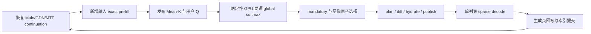

# 阶段 4：Mean-K 检索与稀疏 decode 设计

本文件是阶段 3 收尾后的阶段 4 设计，按 2026-10-02 用户批准的 D8/D9 修订，并保留评分 mask 与首版图像范围的设计审阅意见。阶段 3 第 8 步及三项 dense 组合回归门禁均已完成；证据见 [progress](progress.zh-CN.md)。本文只有设计，不表示阶段 4 代码已编写、构建或验收。先完成本轮全部文档，再按 [实施清单](stage4-sparse-implementation-plan.zh-CN.md) 顺序推进 4.1–4.4；4.4 后停下审阅，Graph 与 ordinary/MTP capture 性能门禁留到下一轮。

当前文档修订基线：`ninfer-4090@a78b533a3080a7d2284a65aae234e5f748474e29`，分支 `feat/kvmem`；实现接口核对基线为 `c4f145e565eab32fb20a0cac38265e2c37211a30`，早期研究基线为 `db8e9641`。约束以 `AGENTS.md`、[README](README.zh-CN.md) 的 D1–D15、设计文档 5.6/5.10.6，以及 `stage3-view-design.zh-CN.md` 为准。后续接口变动时须重新核对，不把提案名当作已经存在的 API。

## 1. 目标、范围与现状

`--kv-mode kvmem` 对本轮新增输入执行完整历史的精确 prefill，然后用 pre-RoPE Mean-K 与本轮用户 query 评分，每轮选择一次逻辑页，decode 只读取入选页及新生成页。完整量化 KV 继续保存在主机归档中；GDN 仍处理完整序列，MTP 沿用独立 sink/recent 窗口。

固定条件：Qwen27B 的 Main 为 16 个全注意力层、24 Q heads、4 KV heads、head_dim=256、64 token/page。C=1；默认 dense 不变；保留原 RoPE/M-RoPE 坐标和缓存 ordinal；不做 re-RoPE、window prefill、query replay、NVMe 或跨请求共享页池。kvmem 磁盘状态缓存继续关闭。

研究基线已有 `HostKVArchive`、两个 copy workers 的 `HostKVTransferEngine`、`KVViewTable`、Main `TieredContext`、MTP 窗口及 retained resume/turn checkpoint。`validate_target_options()` 仍拒绝 KVMem；tiered-exact 为 eager；没有 Mean-K、GPU scorer、轮次 selection 或稀疏 graph 路线。

实现应扩展现有 Main owner，不建立平行缓存 owner。图中的阶段属于提案：



## 2. Mean-K 的定义与捕获点

`TextContext::attn_mix()` 位于 `src/targets/qwen3_6/impl/runtime/text_context_impl.h:807`。捕获放在 Q/K RMSNorm 已生成 `qn/kn` 后、839 行 `ops::rope(..., qn, kn, ...)` 前。索引输入是这些归一化 BF16 值；后续 RoPE、KV 量化、append 保持现有语义。

设有效 frontier 为 F，页 p 的有效 token 集合为 `[64p,min(64(p+1),F))`，有效长度为 `c_p`。每层、每 KV head、每维：

\[
S_{l,p,h,d}=\sum_{t\in p}\operatorname{FP32}(K^{pre}_{l,t,h,d}),\qquad
\bar K_{l,p,h,d}=\operatorname{FP16}_{RNE}(S_{l,p,h,d}/c_p).
\]

逐 token FP32 累加顺序固定，FP16 使用最近偶数舍入。部分页除以实际 `c_p`，不能除以 64；不能用已有 FP16 mean 乘 count 恢复 FP32 sum。页号来自缓存 ordinal，而不是 RoPE axis 或物理槽号。

完整页可封存其 FP16 mean；当前尾页保留 FP32 sum/count。评分前必须发布本轮末尾部分页的有效 mean。跨 chunk、跨轮追加从原有效前缀继续，不能重复累计原 token。新页、活动尾页、每层完成与 D2H ready 使用明确的 frontier/generation；全部 16 层完成后才发布可评分的 index generation。

索引与主机 KV 归档彼此独立：Mean-K 不是量化 KV 的副本，不参与原量化字节 hydrate。主机索引固定最大容量、按 layer/page/KVhead/dim 排列，记录最大 stride；F 增长不能重解释旧地址。归档选 pinned 时，Mean-K 索引也在加载期使用 cacheable pinned，并把额外锁页字节计入准入；否则使用 pageable 索引，经现有锁页传输环送到 GPU。不能使用 write-combined 或运行期新申请锁页内存。

### 2.1 部分页、provisional 与恢复

FP16 mean 和已量化的 post-RoPE K 都不能精确恢复任意部分页的原 FP32 prefix sum。设计不能以 de-RoPE/reduce quantized K 补救，也不能宣称 trim 索引页号就足够。

提案：活动尾页保留最多 64 token 的归一化 pre-RoPE BF16 K，跨层为 2 MiB；本次 target verify 的 provisional K 保存在另一个有界 scratch，最大 T=16 时为 512 KiB。只将 accepted frontier 内的贡献提交到持久 sum/index；拒绝后缀不会进入有效索引。页跨界时保留原尾页资料，不能先覆盖再决定 accepted length。prefill chunk 临时 sum/mean 输出按加载期最大 touched pages 规划。

Main snapshot 增加有界派生状态：尾页逻辑号、valid_count、该精确 frontier 的 64 KiB FP32 prefix sums，以及索引 frontier/generation。snapshot 后同页即使继续写满、驱逐，保存的 prefix sum 仍必须有效。snapshot 保存的是小规模索引 continuation，不复制整份 KV，延续 D12 的 bundle 身份与独占归档约束。

restore/trim 先排空旧 GPU consumers、DMA 与评分任务，再截断更晚页的 index，有效尾页恢复其 snapshot prefix sum/count，重新形成 FP16 mean，并递增 generation。旧 D2H completion、score result、selection plan 不得发布。普通 verify trim 使用尚存 provisional/tail 资料；任意历史 checkpoint trim 必须有该 frontier 的快照资料，不能无依据恢复。

每个活动 prefix sum 带 `base_frontier`：有界 tail/provisional scratch 只能恢复自该基点以后仍保存的贡献。restore 到 checkpoint 后，不能假设先前 tail BF16 资料也被恢复；将保存的 sum作为新基点，后续新贡献独立记录。基点sum与活动sum必须独立保存，追加改变活动sum时不得覆盖基点；例如恢复45、追加到48、截断到46，要从45的sum加第45个token重放，不能用48的sum或FP16 mean倒推。跨页后基点改为新页边界，sum归零。没有对应 snapshot或完整独立前缀资料时，向 base之前 trim必须拒绝该索引操作并走合法checkpoint/冷启动重算，不能用 FP16mean 或 postRoPE量化KV补算。测试区分“accepted长度回退到本次verify基点”与“任意历史前缀截断”。

## 3. 用户 Q 的范围与 continuation 接口提案

`--kvmem-query-tokens` 默认 16。提案只取本轮新提供的最后 N 个用户**文本** token，排除模板头、生成头、assistant/system/tool 历史和图像占位 token；不足 N 使用实际 M。frontend 生成用户文本的缓存 ordinal span 元数据，runtime 按同一 token 集合捕获所有 16 层的 pre-RoPE `qn`。

frontend 分别提供 `current_input_spans` 与 `query_text_spans`：前者参与 D9 的容量规则，后者是其中可用于评分的用户文本子集。必须依据消息/输入事件边界定义本轮，而不是依据实际 prefill 新计算的 token 区间；冷启动重新计算的历史消息不因此自动变成本轮 query。lastN 规则只限定评分 Q；query 页始终硬必选，本轮输入其余页是否软化由第 5 节的预算规则决定。工具结果、附件及其协议包络是否属于当前输入事件，frontend 必须显式记录；不能用 query 文本过滤规则删除这些跨度。

跨 prefill chunk 按 ordinal 拼接，不用“最后一个物理 chunk 的末 16 行”代替 query。query 被 retained/checkpoint prefix 跳过时，优先使用原 exact prefill 捕获并保存的有界 Q metadata；若没有完整匹配 capture，从具有完整 continuation 的必要边界 exact prefill 以捕获 Q，没有该边界状态则冷启动精确重算。该补捕获发生在选块前，不是对已选窗口做 query replay。不能默默使用上一轮 stale Q。

没有新用户文本的 tool continuation，提案沿用上一有效用户 query capture，但需验证 `bundle_identity`、query 所依赖的源 prefix identity、`covered_frontier` 与有效 continuation lineage。`covered_frontier` 至少覆盖最后一个 query ordinal+1，恢复 frontier 必须覆盖全部 query；prefix identity 绑定该有界源前缀的 token、位置/模态身份，而不是对随后不断追加的整个提示词求相等。源 prefix 被改写、截断到 query 之前、bundle reset 或 capture 缺失时不得沿用。capture 保存不可变拥有型句柄、完整的16层/M行有效性与 provenance，checkpoint/retained 不得引用会被下一次捕获覆写的 scratch。日志写明 `query_source=continued-user-capture`、capture ID/原 capture epoch/span/covered frontier、lineage与prefix匹配依据。该规则是待审核接口定义，不是研究基线已有行为。

Q 的原 capture epoch 与 Mean-K 的当前 index epoch 是不同身份：合法 tool continuation 会追加输入并推进索引，但不必改变已验证的历史 Q。评分计划绑定本次 `current_index_epoch/frontier` 与已验证 `query_capture_id/provenance`，完成时检查这对身份仍有效；不能要求两个 epoch 数值相等。restore 产生新 index epoch 时，先验证 capture 的源前缀和 lineage，之后可以显式将该有效 capture 绑定到新评分计划；不得仅因 capture 带旧 epoch 而复用或拒绝。

Q 保留 BF16 原值，由 GPU scorer 转 FP32。M=16 时跨层 BF16 Q 为 3 MiB，不另建 CPU FP32 展开。checkpoint/retained 保存有界 capture 的身份/有效范围与拥有其内存的生命周期，不能只保存指向可能被覆写 scratch 的裸指针。

提案加载期设置最多三个不可变 Q capture槽：活动请求、一个turn checkpoint、一个retained resume同时存活；句柄相同可共享槽，但预算按三者不同计。score/D2H任务只借用已占用槽，不额外创建capture；替换前先排空借用任务并释放旧句柄。M16时三份BF16共9 MiB。Main部分prefix sum按活动64 KiB加两份snapshot128 KiB计，共192 KiB。禁止创建第四个独立live capture或无上限历史checkpoint；槽不足时先结束旧借用/释放可替换句柄，仍无合法槽则明确失败。此账本是加载期提案，必须与Program只保留一个checkpoint和一个resume的实际生命周期一起验证。

首版不做“被引用历史图像”检测，不猜测自然语言引用，也不引入近期图像引用兜底。历史图像作为原子候选组，本轮图像依 D9 和共享页闭包决定硬必选或原子候选。frontend 仍保存 attachment/span ID、content_digest、modality/grid 与 token span 作为闭包身份，图像像素 payload 可释放。依据协议识别历史图像引用及相应强制保留留待后续阶段；此范围意见只写设计，不另立 D 表决策。

## 4. 确定性 GPU 两遍 global softmax 页评分

每个 Q head 映射 `kh=floor(qh/6)`。对已提交且有效的逻辑页集合中的评分域 `D_F`：

\[
z_{l,t,qh,p}=\frac{\langle\operatorname{FP32}(Q^{pre}_{l,t,qh}),\operatorname{FP32}(\bar K_{l,p,kh})\rangle}{\sqrt{256}},\quad
P_{l,t,qh,p}=\frac{\exp(z_{l,t,qh,p}-m)}{\sum_{j\in D_F}\exp(z_{l,t,qh,j}-m)},\quad m=\max_{j\in D_F}z_j.
\]

\[
score_p=\sum_{t=1}^{M}\frac{1}{16\cdot24}\sum_{l=1}^{16}\sum_{qh=1}^{24}P_{l,t,qh,p}.
\]

softmax 在评分域的页维度全局归一化，不能按层合并 logits 后 softmax，也不能对每个 index tile 单独 softmax。域外页概率为零。层/head 求平均、query token 求和，因此非空评分域内 `sum(score)=M`。再除 M 不改变排序，但诊断/参考对照应保持此定义。

FP16 mean 转 FP32，点积、exp 输入与概率/score 累加至少 FP32。显式先减最大值再 exp；独立标量 FP64 oracle 只用于测试，产品没有 CPU scorer 路线。输入 NaN/Inf、空 capture、缺失层、计划绑定的 index epoch 已变或 query provenance 不再有效必须给出错误，不复用旧 score；不以 Q capture epoch 与 index epoch 相等作为有效性条件。相同 score 的次序由逻辑号较新优先决定，不用异步完成顺序。

默认评分域沿用指定参考的 kept-band mask：只有 `nb > budget > 0` 且 `sink + recent < nb` 时，排除 sink `[0,sink)` 与 recent `[nb-recent,nb)` 两段，剩余中间页共同构成一个全局 denominator。未超预算或中间为空时评分全部有效页。`budget` 是扣除生成 reserve/guard 后的 selection 页容量；mask 的 sink/recent 使用截到 `nb` 的配置页数（recent 为 `R/64`），即使 frontier 非页齐也按 `nb-recent` 起算。D9 的 hard recent 则把 `[max(0,F-R),F)` 覆盖的完整页全部保留，可能多一个边界页；不能将这个 hard union 当作 mask。默认只排除上述两段；query、本轮输入、图像闭包等其他 mandatory 页只要不在两段里，仍参与 denominator。被软化的本轮较早输入页始终与历史候选处于同一评分域，不能因 current-input 身份另行排除。

隐藏测试开关 `NINFER_KVMEM_SCORE_ALL_PAGES=1` 将评分域改为所有已提交有效页，保留一切选择和硬保护规则。两种 denominator 必须各有 FP64 oracle 与选择测试，并在日志明确记录 `score_denominator=kept-band-mask|all-committed-pages`、有效/排除页数和 mask 条件。该 mask 核对意见留在设计中，不另增或重写 D 表决策。

Mean-K 是 exact prefill 后的检索代理。较早 query 的页 mean 可能包含本轮稍晚输入 token，因此代理评分不是逐 query 的 causal attention oracle；它不读取未来生成 token。若将来要求代理本身 causal，需要逐 query 截止的前缀均值，不能靠单页 mean 实现。真正 decode/verify 注意力仍以缓存 ordinal 做 `key_position <= query_position` 掩码。

### 4.1 两遍归约、传输与时间账本

262K、M=16 的单次全页点积量为 6.442450944×10^9 次乘加，约 12.9 GFLOP。这是定义计算；两遍若重算点积须另计算量。原 CPU 50–150 ms 估算不再作为阶段四指标。

第一遍为每个 `(layer,qhead,query token)` 求评分域全页的 max 与稳定 denominator；分 tile 时按固定页区间与固定树合并 `(m,l)`，不能使用 tile 局部概率。第二遍使用已完成的全局 `(m,l)` 求页概率，按固定 layer、qhead、query token 顺序累加页 score。禁止以 CUDA atomic 或任务完成先后决定浮点累加顺序；不照搬参考的 atomic 累加内核。可固定 tile 重算 dot，或使用加载期规划的 scratch，必须写清实际资源与事件顺序。

主机 FP16 Mean-K 固定 stride；pinned 归档路径使用额外计入准入的 cacheable pinned 索引直接 H2D，该路径现有传输环为 0 bytes，不能假设有环可借。pageable 索引使用既有传输环与 copy workers，可扩展既有 engine 的有界原始索引 transfer ticket。设备索引 tile、行统计与 score scratch 在加载期 alias exact-prefill 已空闲的 staging/partial 区；排空原消费者后才能借用，评分完成、score D2H 与事件完成后才交还 hydrate/下一轮 prefill。禁止运行期 CUDA/锁页分配，禁止建立第二套设备 owner。D15 只限制传输线程，评分不再有 AVX2、共享 CPU executor 或暂停 copy workers 的契约。

GPU score 对独立 FP64 的完整页向量相对 L2 不超过 `1e-4`；相同输入重复运行 score 与 selected 集合稳定。selected 集合与 FP64 完全相同，唯一允许差异是明确记录的 FP64 第 k 名阈值 epsilon 并列集合：测试固定 `epsilon=1e-6×max(1,abs(score_k))`，只允许在阈值 ±epsilon 内互换，必须仍满足预算、原子闭包和硬保护；阈值外差异失败，日志保存阈值、epsilon、边界页及两套集合。精确 score tie 按较新逻辑号优先。

分别记录 Mean-K/Q H2D bytes、H2D 时间、GPU 第一/第二遍与总 compute 时间、score D2H、capture wait、selection、hydrate、publish、TTFT 分解；性能汇总记录三次原始值与 p50/p95。不能把 H2D 算进 compute 后声称 GPU 加速，也不能减少 layer/head/N、使用半完成 denominator 或 stale score 来满足时间目标。硬 timeout/fallback 留待后续决定。

## 5. mandatory、原子图像与生成 reserve

预算以加载成功的 `actual_view_pages` 为准，`--kvmem-view-tokens` 只是上限。先扣除生成 reserve 与 verification 跨页保护，剩余为 selection 预算。基础 hard 为 sink、最近 R token 的完整页、实际评分 query span 页及其图像闭包；生成 reserve 与 Main guard 独立计费。硬集合不得截短或按分数淘汰，闭包后超预算必须明确拒绝并输出各项唯一页数。

令 V 为物理 view 页数，G 为新增生成 reserve 页数，H 为额外 Main provisional guard，C=V-G-H。基础 hard 与全部 `current_input_spans` 转页并作图像闭包后的 union 若不超过 C，本轮输入全部硬必选；否则仅保留基础 hard，本轮较早非 hard 页转为 scored candidates，与历史共同竞争，图像始终原子选择。记录 `current_input_softened_pages` 及原本 current 页数、base hard、闭包、G/H/C，不能偷偷减少 recent/query。工具续接沿用旧 Q 时，硬 query span 也是该已验证 capture 的实际跨度。输入事件跨度不等于实际 prefill delta；已知 span 在昂贵 exact prefill 前准入，最终选择再校验实际容量/闭包。

因此既有单条 128K/262K 长输入 needle fixture 在 128K/32K view 下可以合法运行：较早 current 页依容量规则软化，不能把它们排除出评分域。此前“整段 current 必选导致拒绝”的限制已由 2026-10-02 D9 修订替代；仍保留原设计记录和任何实际失败，不把文档修订当作质量通过。另增加明确历史消息加本轮短 query 的结构化 fixture，覆盖续接/复用语义；它是额外测试，不代替单条长输入。基础 hard 的图像闭包过大时仍拒绝，报告 hard/current/image/sink/recent/query/reserve/guard 页数；软化后的非hard图像作为原子候选，装不下则跳过。

图像 `[begin,end)` 转页范围 `[floor(begin/64),ceil(end/64))`；来自 `VisionItem::token_spans`，不用 RoPE 三轴值求页。图像共享边界页时构造传递原子闭包；必选文本页一旦与图像重叠，也扩展为完整图像闭包，否则会因共享页产生半张图。多个 token spans 属于同一原子图像时合并其唯一页集。

图像候选 score 为跨度页 score 的最大值；成本为尚未入选的唯一页数。整个闭包装不下剩余预算就跳过，不能拆开。普通文本页按 score 降序、logical_page 降序 tie-break 填充；最后统一去重、logical_page 严格升序。

`--kvmem-gen-reserve` 默认 6144。F 位于页内时，未来写入覆盖 `ceil((F%64+G)/64)` 页，活动尾页若已计 selection 就避免重复收费；F 对齐时覆盖 `ceil(G/64)` 新页。另计 Main verify 与 MTP provisional 跨页 guard，不能将 MTP pool 的 guard 当作 Main reserve。

生成沿原缓存 ordinal 写入 reserve ring，并更新 Main 索引。页回写完成才允许复用。reserve 耗尽后，先淘汰最早检索进入视图的非 mandatory、非当前 recent/provisional 保护、状态为 Both 的页，更新列表；本阶段不重新做 query 检索。若没有安全 victim，等待归档或明确容量失败，不驱逐 DeviceOnly。

exact prefill 可使用完整物理 view，post-prefill selection 才让出空 reserve；若提早扣除 reserve 导致 prefill view 变小，要纳入统一预算与性能分析，不能悄悄改变阶段 3 性能口径。

## 6. plan、diff、hydrate 与发布

提案 `SparseSelectionPlan` 是纯规划结果：bundle/index/view generation、F、query identity、selected IDs、mandatory/group 闭包、reserve/guard、retained/add/remove、期望槽映射及字节/传输统计。检查完成后才提交，失败不能部分修改旧视图。

执行顺序：排空旧 consumers 和会读旧物理槽的 D2H/H2D；只移出 Both；intersection 保留原物理槽；新增页使用空槽或安全释放槽，从主机逐 plane hydrate；所有 16 层的共享页组完整就绪后安装 block table、列表与 key prefix。尽量按归档连续逻辑范围合并传输，destination slots 不连续时沿现有 hydrate scatter。

阶段 3 第 8 步已经提交的 restore 接口可供阶段 4 扩展：`plan_restore()` 依据当前 slot owner 和有效页状态保留仍存活、在恢复 frontier 内有效的物理槽，`hydration_pages` 只列缺失的所需逻辑页，`TieredContext::Impl::hydrate(restored)` 只传输这个集合。checkpoint 记录的旧物理槽不能复活；已被覆盖的槽须按当前存活状态重新分配，完整层/plane 有效前缀才能保留。partial 页的无效尾部由 frontier 屏蔽、续写前覆盖，保留 KV 槽不能代替 Mean-K prefix sum 恢复。此处恢复机制已通过 CPU/GPU CTest，262K 实测追加调度传输 0 bytes、回滚 2162688 bytes（2.0625 MiB）；第 8 步三项 dense 组合门禁也已通过。阶段 4 的 Mean-K/selection 扩展仍只是提案。

量化页逐字节换入，原位置不变。失败计划不得发布，generation 标签不能代替 DMA 生命周期排空。下一轮 exact prefill 仍读取完整历史，sparse decode 才只读 selected resident 页和有效生成页；不为未入选 HostOnly 历史发起 staging。

纯规划/准入失败可保持旧视图可执行；DMA开始后的失败则不同：若victim槽已经覆写，仅“不发布新表”不能保证旧表仍有效。提案立即将Main owner标记poisoned，阻止后续graph/eager执行，排空持有相关地址的任务；随后从权威归档重hydrate完整旧执行视图并重新验证发布，或reset该bundle后精确重建。完成恢复前不能继续读旧mapping。日志区分plan拒绝与transfer/恢复失败，测试注入中途DMA/plane失败；poison/reset是bundle生命周期操作，不以CUDA device reset替代。

提案 core 接口职责：`MeanKIndex::commit/trim/restore/publish()`；`PageScorer::score()`；`SparseSelector::plan()`；`KVViewTable::plan_selection/install_selection()`。target owner 接口职责：设置请求 query/span 元数据、捕获 pre-RoPE、prefill 完成选择、sparse block prepare、accepted frontier 提交、snapshot 派生状态。名字是设计建议，不是已有 API。

## 7. 单列表 sparse eager decode 与后续 CUDA Graph

复用现有 `AttentionPageAccess{logical_page,physical_page}` 与部分 attention/LSE 数学：一张 logical_page 升序列表，一遍 resident attention，完整页及 frontier 末页有效长度通过 prefix 描述。不能将紧凑列表 ordinal 当原 key 位置；causal 掩码使用原逻辑号×64加页内 offset。

本轮 4.4 只启用 C=1、Graph=off 的 sparse eager，ordinary 与 MTP verify 都走 eager。下一轮才实施动态 Graph descriptor、ordinary/MTP capture 与对应性能门禁；以下是后续契约，不属于 4.4 完成条件。研究基线 `gqa_attention_partial.cu:37–38,50–51` 将 `pages.ne[1]`、frontier、T、splits 作为 launch 参数；因此只保持地址不变不能使同图支持动态 selection。不能仅解除 `layouts_impl.h:800` 的 Dense 限制。

提案新 sparse graph descriptor 放在固定 device 地址：list_count、frontier、visible-key count、valid-query count、固定 capture envelope 所需状态。pages/prefix/blocktable/output/scratch 的地址和上限加载期确定，kernel 从 descriptor 读取变化量；固定 split policy 或有限 graph profiles，不能依 DMA 到达顺序决定 split。ordinary 与 MTP verify 分别捕获。

动态状态必须覆盖整条graph：KV append的有效列mask/有效cache ordinal与写入物理页、Q/K的原始1D或M-RoPE position输入、attention的list_count/frontier/prefix终点与有效key数，以及Mean-K provisional capture的有效列/ordinal。T使用profile固定envelope，padding列不能写KV、改变索引/GDN或被当作有效query；已有GDN/MTP valid-column契约一起验证。prefix的有效边界按本次列表重建，较长旧列表的尾部不得因捕获常量或未更新count进入读取。仅动态attention参数而append仍捕获旧位置不构成正确graph。

GPU scoring、CPU selection、hydrate、列表上传与回写完成管理在 graph 外执行边界；graph 内只有不分配/不等待 host 的算子序列。Mean-K provisional capture 若进入 graph，使用加载期 scratch，与 accepted commit 分开。后续 graph/eager需对照 list增长/缩短、跨页、reserve淘汰、selection变化、restore与valid columns，确认旧访问不残留。

## 8. 参数与加载期资源账本

保留现有 `dense|tiered-exact|kvmem`、host archive、view、sink、MTP window、staging 参数及已经实现的 `--kvmem-prefill exact`；4.4 完成稀疏 eager 路线后才解除 KVMem 的明确拒绝，启用范围为 C=1、Graph=off，启动日志明确打印实际`graph=off`及阶段限制。沿现有tiered显式禁用Graph方式处理默认`use_cuda_graph=true`，不新增必须传`--no-cuda-graph`的准入条件，不捕获Graph也不静默忽略配置。提案新增 `--kvmem-recent-tokens 8192`、`--kvmem-gen-reserve 6144`、`--kvmem-query-tokens 16`。window 仍明确拒绝；查询数需正且有加载期上限；页窗口/reserve 按 64 粒度验证，并检查 sink/recent/query/reserve/guard 及最大 prefill chunk 可行性。

| 新资源，262K/M16示例 | 字节/性质 | 规划要求 |
|---|---|---|
| 主机 FP16 Mean-K | 128 MiB | `ceil(max_context/64)×16×4×256×2`，固定stride；archive pinned 时 cacheable pinned 直传并计额外准入，否则 pageable 经既有环 |
| GPU FP32 continuation/事务sum | 256 KiB | active、独立base、只读seed、output各64 KiB；跨页CTA不能覆写共享seed |
| 主机 FP32 continuation与snapshot | 256 KiB | active/base各64 KiB；checkpoint/retained snapshot各64 KiB，最多两份snapshot |
| 有界 BF16尾页资料 | 2 MiB | 64×16×4×256×2，尾页回滚恢复资料 |
| provisional BF16 K | T16为512 KiB | 按最大verify有效列规划，跨页资料不覆盖原尾页 |
| 主机用户 Q | 三份BF16共9 MiB | active/checkpoint/retained最多三个可分页槽；任务只借用槽，无 CPU FP32 展开 |
| Q capture设备/锁页中转 | GPU BF16 3 MiB，加cacheable pinned 3 MiB | 一个完整capture的固定device buffer与D2H bounce；三主机句柄不共享可覆写bounce |
| GPU Mean-K / Q 评分输入 | 全索引上限128 MiB；Q BF16 3 MiB | 按加载期方案整体或tile alias空闲staging；Q可复用已完成device capture或固定上传区，列明地址与独占事件 |
| GPU 两遍统计/score scratch | 6144行FP32 `(m,l)` 为48 KiB，页score为16 KiB，另固定tile归约空间 | alias空闲partial/staging，固定树与固定L/H/M累加；不需两worker logits或CPU层结果 |
| 主机 score / selection | P4096时FP32 score 16 KiB，另有界plan/list | score D2H完成后CPU pure selector；cacheable pinned D2H bounce加载期规划或证明既有环可借用 |
| chunk FP16 mean设备输出 | T2048最大1.03125 MiB，另64 bytes counts | 起点非页齐最多33页，`L×touched_pages×KVH×D×2`；每页sum在寄存器累加，输出仅保留最终部分页FP32 sum，已计入上方固定sum区 |
| 主机待发布mean/sum patches | T2048最大1.09375 MiB | 1.03125 MiB mean加64 KiB sum；全部16层ready后再统一发布，避免部分层新旧generation混用 |
| Mean-K D2H中转 | 上述示例cacheable pinned 1.03125 MiB | pageable路径覆盖最大chunk mean输出；pinned索引可直接D2H到固定stride切片，均以事件保护 |
| selection列表；后续graph descriptor | O(actual_view_pages) | eager列表固定上限与地址；graph descriptor下一轮规划，现有partial/staging/归档预算继续保留 |

表为定义计算而非实测分配；不同capture流水线可以复用scratch，但需证明事件生命周期不重叠。明确 host/device/pinned归属并分别加入 `build_workspace_plan()`、主机准入和working-set账本。运行期不新增锁页分配，不因为稀疏decode省staging而漏掉下一轮exact prefill所需资源。

上表的capture/snapshot最大份数为加载期硬上限；配置的最大N/T会改变每槽字节，不能只按示例M16分配后接收更大请求。GPU scorer、DMA和后续graph在槽上各有明确借用结束事件；新请求、替换checkpoint、retained覆盖和reset按同一资源账本释放，计入外部日志的高水位。CPU视觉仍在prefill前同步完成，不与最多两个传输worker重叠；D15不承担评分线程契约。

为闭合首版资源账本，尾页BF16/provisional资料在GPU，active/base/seed/output sum为四个独立设备区；主机保存active/base镜像及最多两份snapshot sum，待发布patch另列。Q原值三主机槽、device capture与pinned bounce合计15 MiB，bounce不可作为持久capture句柄。新增主机索引/中转字节计入D4/D14的可用物理内存和锁页准入，不能在分配8.25 GiB归档后漏计128 MiB pinned索引。设备评分区按加载期生命周期alias取峰值，不把空闲staging/partial重复计费，也不能在hydrate或下一轮exact prefill时继续占用。pinned归档无既有256 MiB环，pageable才复用该环；任何替代中转方案均需列账和事件证明，运行期不得分配。

## 9. 实施文件与参考移植

| NInfer 文件 | 职责 |
|---|---|
| `src/core/kvmem/` 新 Mean-K/scorer/selector 文件 | host固定stride索引、GPU评分调度、CPU pure selection plan，独立于模型执行 |
| `kv_view_table.{h,cpp}` | hard保护、reserve槽、差分计划/安装；保留原logical ID |
| `host_kv_transfer.{h,cpp}` | 复用既有worker与hydrate，pageable索引复用环；必要时扩展有界原始索引transfer ticket |
| `include/ninfer/ops/` 与 `src/ops/{wrapper,launcher,kernel}/` | preRoPE BF16累加、mean输出、provisional捕获、确定性两遍评分；复用单列表partial attention，graph接口留下一轮 |
| `tiered_context.{h,cpp}`、`tiered_plan.h` | Main owner、exact/sparse阶段、派生snapshot与发布 |
| `text_context_impl.h`、`text_prefill_impl.h`、`program{,_impl}.h` | 捕获、用户span、acceptedcommit、prefillfinish选块、resume/checkpoint/graph调度 |
| `layouts_impl.h`、`impl/state/decoder_state.cpp`、`src/runtime/engine/kv_capacity.*` | mode检查、统一预算与评分alias生命周期；首版C=1/Graph=off |
| `include/ninfer/types.h`、CLI/serve/product options | 参数及身份绑定；frontend明确query/current/image span，首版无历史图像引用检测 |
| `tests/core/`、`tests/ops/`、`tests/targets/qwen3_6/` | pureplan、FP64算子、restore/eager/e2e门禁；graph后续 |

避免 README 第4节的三值合并敏感投影/LM head/artifact格式位置。无需修改视觉编码器数学；prepared prompt仅增补所需身份元数据。

指定源为 [kvmem/kvmem-qw3](https://github.com/kvmem/kvmem-qw3/tree/1cf3b2f83bfc071ada9c57491a7d121723051ac0)，本地路径 `D:/deeplearning/NInfer/logs/kvmem-stage7-8/kvmem-qw3-reference`，已复核 HEAD 为 `1cf3b2f83bfc071ada9c57491a7d121723051ac0`；以下行号对应此 commit。只参考本地固定源码，不混用后续远端版本。

| 源文件/函数 | 保留的思路 | 改写/排除 |
|---|---|---|
| `src/kvmem_store.cpp:354` `pick_topk_blocks()` | 去重、topk、较新ID tie、升序返回 | recent源码best-effort，与D9不符；删除quota/profile/GC |
| 同文件481 `pick_semantic_groups()` | 整体成本、超预算跳过、共享页去重 | 新建图像闭包，不能直接套round/message |
| 同文件601 `set_selection()` | overlap及retained/add/remove diff | 不搬compact window_pos/baked_pos/remap/reRoPE/rawK |
| `src/kvmem_request_plan.hpp:67/242/316` fit/draft/finalize | pure准入、logical/selection/generation budget区别 | 不照搬长tool suffix规则；按D9软化本轮较早非hard页，hard闭包溢出拒绝；无privatequery/pressure/window/replay |
| `src/global_kv_page_pool.hpp` `GlobalKvPagePool` | live pin不得归还、callback不持mutex | 复用PagedKVPool，不引入global跨请求pool |
| `include/qw3/pinned_kv_tier.hpp` `place_block*()` | 固定槽、覆写前spill完成 | 复用HostKVArchive，不搬LRU/热度/NVMe或大pinnedtier |
| `src/qwen_executor.cpp:18261/18991` query/kbar capture | span跨chunk、fixedstride、ready条件 | 源码捕获后deRoPE；本项目直接preRoPE |
| `src/kernels_cuda.cu:8049/8621` content batch/merge | partial overlap样例 | merge用FP16mean×prior还原sum，须重写FP32sum契约 |
| 同文件5340 `block_attn_score_softmax_pages_kernel()` | GQA映射、页softmax、L/H平均与token累加 | 按确定性GPU两遍重写，不搬atomic/subblock；默认保留仅sink/recent的kept-bandmask语义 |
| `qwen_executor.cpp:23697/19373` mean scorer/CPU-index scorer | ready失败条件、generation、计时、host索引流到GPU | “CPU”指hostindex流到GPU；约23750–23790核对默认mask条件，`QW3_KVMEM_MASK_KEPT=0`为全页；本项目全页测试开关见§4 |
| 同文件11912/14167/14659 stagein/stageout/assemble | 差分传输、slotconsumer排空 | Windows沿既有transferengine重写，剥离位置压缩 |

源码git blob SHA-1已在该checkout用 `git hash-object` 核验：

| 路径 | blob SHA-1 |
|---|---|
| `src/kvmem_store.cpp` | `4bb90e03d4ef281a85a94be6b31bdcebe69d3aea` |
| `src/kvmem_request_plan.hpp` | `accc3292a68994bd494e0e5391d21f8545992adc` |
| `src/global_kv_page_pool.hpp` | `13006a4a0e82679ab531310f1c0124081da763b6` |
| `include/qw3/pinned_kv_tier.hpp` | `49624ff925455ebd3d676cc0a95efc8613d10f58` |
| `src/qwen_executor.cpp` | `825a4474ec6587d10d79429ec8462e8d4c5c33fc` |
| `src/kernels_cuda.cu` | `928530e8872f8536217fe47264d85611ece353ce` |

### 9.1 许可与平台边界

源 `LICENSE` 为Apache-2.0；`THIRD_PARTY_NOTICES.md`声明除文件另行注明外按Apache-2.0，另列部分llama.cpp派生CUDA的MIT许可。移植保留适用原版权/许可/注释，添加具体仓库、commit、path/function及修改说明，携带Apache许可文本和适用notices。上述目标文件未观察到明确作者copyright头，不能编造年份或作者。第三方通知中的其他组件不因参考几行算法就全部复制为项目依赖。

`qwen_executor.cpp`含pthread affinity、`/sys`NUMA/PCI查询；按Windows现有线程/事件/内存接口改写。FlashInfer/CUTLASS/CuTe adapter、sm120分派及MIT llama派生整套kernel不移植；attention使用现有Ada ops。不得新增第三方依赖来替代未完成的GPU scorer。实现4.2移植 `pick_topk_blocks`、`pick_semantic_groups`、`set_selection` 思路时逐项保留本节来源与许可说明。

## 10. 单元门禁、质量矩阵与日志

按 [实施清单](stage4-sparse-implementation-plan.zh-CN.md) 顺序执行：4.1 Mean-K 与部分前缀，4.2 GPU scorer 与 CPU pure selector，4.3 frontend query/current/image span 与三槽 capture/Main snapshot，4.4 exact-prefill→capture→score→select→plan/diff→hydrate/publish→sparse eager。每步新增相应 CTest、运行当时全量 CTest、更新 progress，由主任务分别 commit/push 后进入下一步。4.4 完成后停止并交付审阅，Graph descriptor、ordinary/MTP capture 与性能门禁下一轮。不能先开 KVMem 产品入口再用旧 tiered-exact 路径冒充稀疏 decode。

| 门禁 | 覆盖与判据 |
|---|---|
| `test_meank_accumulate` | FP64oracle；1/63/64/65token、跨chunk/轮次、partialseal、FP16RNE、provisionalaccept/reject、非64frontierrestore |
| `test_kvmem_scoring` | FP64独立globalsoftmax；GQA、极大有限logit、默认kept-band与all-pages两denominator、mask条件/非页齐recent区别、L/H/M固定归约、相对L2≤1e-4、selected集合一致及明确FP64第k阈值epsilon唯一例外、重复稳定、NaN/缺失generation拒绝 |
| selector/view/plan | hard溢出原子拒绝及各项页数、current全部fit/较早页soften且同域竞争、recent/query完整、历史图像原子候选/本轮图像D9、共享图像闭包、整图不足跳过、稳定tie、intersection复用、OnlyBoth驱逐、reserve/guard、中途DMA失败poison/恢复 |
| resume/checkpoint | 前缀sum在尾页封存/驱逐后仍恢复；无snapshot不得trim到base之前；当前有效槽保留且只hydrate_missing；capture三槽账本/借用生命周期与prefixidentity；合法旧capture配新indexepoch；恢复早于query/branch改写时拒绝；旧score/ticket拒绝；重复restore、追加只算新token |
| sparseattention | selected-subset FP64oracle，远逻辑号、空洞、末页、因果、有效列、rk4旋转输出边界；不能用全历史dense作稀疏数值oracle |
| 4.4 eager | arbitrary resident集合后下一轮完整历史exact prefill、单列表decode/verify、有效列/原位置/跨页/reserve淘汰、restore与DMA中途失败poison恢复；新增GPU owner/kernel终版跑Compute Sanitizer 13.0.85的racecheck、synccheck、initcheck三项，memcheck可额外补充但不能替代 |
| 后续 graph | 同图动态列表/prefix终点、append有效列/物理页/cache与RoPE位置、frontier/validcols、padding无写入、ordinary/MTP capture、跨页/restore/reserveeviction及对应性能门禁；本轮未实施/未验收 |
| 回归 | 授权后新增相应 CTest 并跑当时全量清单；dense 沿用 README 三项组合门禁：两版相同临时补丁下完整词表逐位比较、加载计划一致、生产算法分歧步按门禁 B 的并列与包络判定，三项都必须通过。原金标准和失败记录保留；不得依据旧 AGENTS 的84项忽略新增测试 |

合成矩阵覆盖 `2 contexts (128K/262K) × 2 views (128K/32K) × 至少3个needle位置 × 2 denominators × 3次独立运行`。每个case冻结输入、tokenizer/template、命令、输出预算、dtype与哈希，保留既有单条长user needle fixture，其较早 current 页按D9合法软化；另增加明确历史消息加本轮短query的结构化 fixture，测试多轮与复用。128K/262K记累计上下文配置和实际有效token数，不能把容量值写成实际prompt恰好相等。kvmem INT8/128K视图对dense rk4v4-e8；kvmem INT8/32K视图对tiered-exact INT8，保留5.10.6既有质量比较，不改dense内核/分派。

每个case记录历史/current/query边界、base hard/闭包/softened/selected/add/remove/retained页数、reserve/guard、actual selection容量、两种denominator与准入结果；报告TTFT的exact prefill/capture wait/Mean-K与Q H2D/GPU score compute/score D2H/selection/hydrate/publish分解、hydrate字节、decode tok/s和MTP draft/accepted。needle逐case验算，128K视图对dense的合成质量不低于基线，32K档完整报告与tiered-exact差异。MTP接受率、多轮复用依README既有门禁，不把模型logits既有波动改写成逐位一致或固定1e-3。

needle覆盖至少三个插入位置与重复干扰，位置由冻结manifest明确列出。多文件未来验证文件身份、跨文件联合事实及引用；tool replay未来保留messages、tool_call_id、tool名称/参数/result及轮次边界，测试完整重放与checkpoint/retained续接。**真实脱敏多文件/工具矩阵未验收，仍需用户语料；合成矩阵通过不表示阶段四全部质量/性能验收。** Graph与ordinary/MTP capture性能门禁也未验收，留到下一轮。

真实回放还需原请求的 `tools` 函数 JSON Schema、`tool_choice`、`response_format`、采样/输出上限、stop 与思考/模板选项，以及每轮输入边界和附件身份；原请求没有的字段明确记为未提供，不能猜测补入默认值。messages 保留原 assistant/tool 内容及调用顺序，用于真实协议重放；expected/validator 另行给出要核对的事实，不能直接把原模型回答视为正确答案。

提案语料JSONL一行一case，使用原始协议messages与完整期望；下例仅演示格式，token规模由tokenizer核验后记录，真实工具内容不可用占位数据替代：

```jsonl
{"case_id":"tool-replay-format-001","suite":"tool-replay","context_target_tokens":131072,"tools":[{"type":"function","function":{"name":"read_file","parameters":{"type":"object","properties":{"path":{"type":"string"}},"required":["path"],"additionalProperties":false}}}],"tool_choice":"auto","request_options":{"temperature":0,"max_tokens":1024},"messages":[{"role":"user","content":"查找 config.toml 的 worker 数，再核对 deployment.yaml 中对应的副本数。"},{"role":"assistant","content":null,"tool_calls":[{"id":"call_cfg_01","type":"function","function":{"name":"read_file","arguments":"{\"path\":\"config.toml\"}"}}]},{"role":"tool","tool_call_id":"call_cfg_01","content":"[server]\nworkers = 8\n"},{"role":"assistant","content":null,"tool_calls":[{"id":"call_dep_02","type":"function","function":{"name":"read_file","arguments":"{\"path\":\"deployment.yaml\"}"}}]},{"role":"tool","tool_call_id":"call_dep_02","content":"spec:\n  replicas: 3\n"},{"role":"user","content":"依据刚才两个文件，给出 worker 数与副本数。"}],"source_files":[{"path":"config.toml","text":"[server]\nworkers = 8\n"},{"path":"deployment.yaml","text":"spec:\n  replicas: 3\n"}],"expected":{"facts":{"config.toml:server.workers":8,"deployment.yaml:spec.replicas":3},"required_source_paths":["config.toml","deployment.yaml"]},"validator":{"kind":"structured-facts","version":1},"fixture_sha256":null}
```

fixture SHA-256 在最终输入冻结后计算，实际日志脱敏后也重新 hash。摘要放在独立 manifest，计算对象为冻结 JSONL 文件的原始 UTF-8 字节，不把自身摘要写回被哈希的同一文件；示例内的 null 仅是格式占位。运行 manifest 记录：commit/artifact 和 fixture SHA、模板/tokenizer 身份、完整命令、上下文与 actual view、mode/dtype/MTP、桌面负载、冷启动或 reuse、queryspan/source/generation、denominator/mask条件与排除页、hard 页与图像闭包、`current_input_softened_pages`、selected/add/remove/retained 页数、hydrate/H2D 字节、索引有效 frontier、prefill/capturewait/H2D/GPU两遍compute/scoreD2H/selection/hydrate/publish/TTFT/decode、MTP draft/accepted、输出 token ID/答案/validator 结果。

结果放仓库外，保留失败和旧配置，不覆盖以挑选成功样例。质量、时间、字节均注明定义计算/估算/实测；无真实语料时明确未验收，不把“格式准备完毕”写为工具质量通过。

## 11. 本轮实施边界与停审

本轮采用：lastN新用户文本span；无新文本tool续接仅沿用同bundle、prefix identity及lineage匹配的有效capture；prefix reuse跳过Q时使用有界capture或从合法边界exact补捕获；64 KiB部分前缀snapshot及有界tail/provisional资料；固定stride主机Mean-K与确定性GPU两遍评分；默认仅sink/recent band mask及隐藏all-pages对照；D9基础hard和current容量软化；历史图像原子候选、首版无引用检测。D8/D9用户批准日期为2026-10-02，mask和引用范围是设计审阅意见。

先修订全部文档再实施4.1–4.4，每步CTest及全量CTest、证据/progress、独立commit/push均完成才进入下一步。4.4仅交付C=1/Graph=off的sparse eager和合成验收，随后停下审阅；Graph、ordinary/MTP capture性能门禁及真实多文件/工具矩阵明确未验收。若实测要求改变D1–D15、dense行为、三值敏感位置或新增依赖，依README记录证据和需要决定的问题；不能在timeout、capacity fit或reference默认参数中暗中改变契约，也不为已批准的常规步骤重复索要许可。
